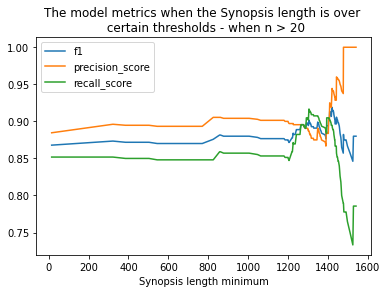

# Expanding the tech grants definition

We extended our 'tech' grant definition to include non-UK and non-health 'tech'. Because of this we needed to retag some of the training data, and retrain and analyse the model.

In this document we will explain our procedure and results for:
1. Retagging data points previously classified as not-tech.
2. How well does the previous model work on the newly updated data.
3. Retrain an ensemble model with the newly updated training data.
4. Differences between the old and new models.
5. Performance analysis of the new model.

## Summary

The retagging of the data made the following changes:

| Data type | Previous number | New number | Difference |
| --- | --- | --- | --- |
| RF tech data points | 23 | 144 | +122 |
| EPMC tech data points | 143 | 191 | +48 |
| Grants tech data points | 111 | 164 | +53 |
| Grants not-tech data points | 1004 | 358| -646 |
| Final training data (tech) | 214 | 347 | +133 |
| Final training data (not-tech) | 883 | 349 | -534 |

Using the 201118 ensemble model evaluated on the new data the F1 dropped from 0.87 to 0.6, the precision from 0.87 to 0.68, and the recall from 0.87 to 0.53.

Thus we retrained an ensemble model. The 4 models with good metrics (>0.8) were bert_SVM_scibert_210128, tfidf_log_reg_210128, tfidf_SVM_210128 and bert_naive_bayes_scibert_210128. We chose agreement of 3 out of 4 of the models for a grant to be classified as a tech grant. This gave us an overall reduction in the F1 metric, but an increase in precision and a decrease in recall. The number of tech grants predicted has now increased as may be expected.

| Ensemble model | Number of models that need to agree | Number of relevant grants | Test F1 | Test precision | Test recall |
|---|---|---|---|---|---|
|201118|3|2956|0.873|0.873|0.873|
|210129|3|3719|0.857|0.889|0.828|

The tech grants predicted between the 2 models didn't overlap too much - 1709 grants are in both lists, 2010 grants are in the new list but not the old, and 1247 grants are in the old list but not the new list.


An analysis was performed to see how well the new model performed on data from fortytwo (rather than the 360 giving data the model has been previously trained and tested on). It generalises to this data well, so using the fortytwo data in production should be fine.

|Data | Sample size|    Proportion actually tech|   accuracy|   f1| precision_score|    recall_score|
|---|---|---|---|---|---|---|
|Test 360 giving  |174    |0.5    |0.862  |0.857  |0.889  |0.828|
|Test 42 warehouse  |174    |0.5    |0.868  |0.867  |0.872  |0.862|

An analysis showed that the model performs best when the synopsis text given is >1300 characters in length.

|Synopsis length|Sample size |Proportion actually tech   |accuracy|f1|precision_score |recall_score|
|---|---|---|---|---|  ---| ---|
|(0, 1300]|61 | 0.410  | 0.820  | 0.744 |  0.889  | 0.640      |           
|(1300, 4000]|113 |0.549 |  0.885  |0.896  | 0.889 |  0.903|


# 1. Retagging data points previously classified as not-tech

Previously the tagged training data came from the 4 files:
- 'data/raw/EPMC/EPMC_relevant_tool_pubs_3082020.csv'
- 'data/raw/EPMC/EPMC_relevant_pubs_query2_3082020.csv'
- 'data/raw/ResearchFish/research_fish_manual_edit.csv'
- 'data/raw/wellcome-grants-awarded-2005-2019_manual_edit_Lizadditions.csv'

We made copies of these and stored them in the `data/raw/expanded_tags/` folder.

We manually checked the data which was previously labelled as not-tech and relabelled it as tech if it now satisfied:
- tech not just in the UK
- tech not just in the health data sphere

We kept everything else the same so that the rest of the pipelines continue to work.

## ResearchFish

The original 'code ' column data is stored in 'Previous code'.

The previous codes were:
- 1 = Relevant tool
- 2 = Relevant model
- 3 = Relevant data set
- 4 = More information needed
- 5 = Not relevant

Thus, we reread through the articles with 4's and 5's and updated the 'code ' column accordingly if we felt a change was needed. There are a number of ResearchFish data points with 5 digit grant references, e.g. '10501', since our pipeline will not link these with Wellcome grants anyway, we don't spend the time tagging these. This leaves us with 688 ResearchFish data points to check.

We think of tech now as evidence that something (a model, dataset, tool) has been produced (not just used). Also that it doesn't need to be specific to health or a disease in particular. e.g. "A deep neural net based Machine learning algorithm that effect predicts the effect of sequence variation on the epigenetic status of DNA." is now code 2, before it wasn't clear if it was linked to a particular disease so was code 4.

### Databases

The dataset can be highly biological, e.g. 'An online database of antigen-specific TCR sequences', but since they've produced it and it's out there for use, it's a dataset code 3. However, just producing genetic data but not specifying it's in a dataset output is a 4, e.g. "21 whole genome microarray sets". The key thing with datasets is that it's clear they are out there published for use, if in doubt of this use code 4. The reason for this, in part, is because creating data in one type or another probably exists in every grant, so we need to specify that it's not just generation of data - but dissemination of it too. In the sense of 'tech' adding data to an existing database isn't classed as tech, so this will be code 5, e.g. "Submission of 13 protein structures to Protein Data bank".

### Tools/models

It can't just be 'performed analysis', e.g. "performed proteomic analysis of paatient cells and skeletal muscle samples", this doenst have enough information of whether their analysis was outputted into something concrete (this would be a 4).

### Data update


| Code | Number of RF entries before | Number of RF entries 22/01/21 |
| ---- | -------------------- |---|
| 1    | 9                    | 99|
| 2    | 3                    |17|
| 3    | 11                   |28|
| 4    | 100                  |110|
| 5    | 1137                 |213|
| Nan  | 4                    |797|

Thus we tagged an additional 121 tech RF data points (23 to 144 with code 1, 2 or 3).

The most relevant RF file is 'SoftwareAndTechnicalProducts', but still only 70% of them yield tech as an output - so perhaps not a high enough proportion to automatically tag these as tech grants.

| File type | Proportion of tagged entries which are 1, 2, 3 |
| --- | --- |
| MedicalProductsAndInterventions | 2+0+1/40 = 8% |
| OtherOutputsAndKnowledge | 0+0+0/65 = 0% |
| ResearchDatabaseModels | 31+6+24/189 = 32% |
| ResearchToolsAndMethods | 10+2+1/77 = 17% |
| SoftwareAndTechnicalProducts | 56+9+2/96 = 70% |

## EPMC publication abstracts

The original EPMC tagged was slightly more complicated. We merged the tagging done by 4 people, where if the same publication had been labelled the order of trust was Becky > Nonie > Liz > Aoife.

The original codes for the EPMC publications were:

- 1 = Relevant tool
- 2 = Relevant model
- 3 = Relevant data set
- 4 = More information needed
- 5 = Not relevant
- 6 = Edge case

For this task we first created a column 'Final original code' which replicates the order of labelling trust (final label is that tagged by Becky > Nonie > Liz > Aoife). We then copied this to a column 'Revised code' and deleted entries which were coded 4, 5, 6. We filtered this to only include blank codes (i.e. we aren't going to re-read any 1, 2, 3 codes), and only included non-blank 'WTgrants' rows.

#### Query 1

The filtering left us with 525 records for the query 1 dataset. It is these, previously tagged as 4, 5, 6 and with a grant number, EPMC rows we read and label.

We re-tagged the code 4 and 6 first since they might be low hanging fruit for now being classifed as tech, then we sorted by pmid so we went through in a random order (since we know it's unlikely we'd have enough time to re-label 525 publications).

#### Query 2

For query 2 the previously tagged as 4, 5, 6 and had a grant number resulted in 399 publications. Again, we sorted by pmid as a way to randomise the order.

### Data update

Number of EPMC entries:

| Code | Query 1 - before |Query 2 - before|Query 1 - 22/01/21 |Query 2 - 22/01/21|
| ---- | --- | --- |---|---|
|1|54|19|90|19|
|2|18|35|24|40|
|3|9|8|10|8|
|4|10|5|13|7|
|5|584|512|17|28|
|6|51|1|0|0|
|Nan|781|9129|1353|9607|

Thus we tagged an additional 48 tech EPMC data points (143 to 191 with code 1, 2 or 3).

## Grants data

The original codes for the grants data were:
- 1 = Relevant
- 4 = Not sure
- 5 = Not Relevant

For this task we first created a column 'Final original code' which replicates the order of labelling trust (final label is that tagged by Nonie > Liz). We then copied this to a column 'Revised code' and deleted entries which were coded as 4 or 5. We filtered this to only include blank codes (i.e. we aren't going to re-read any 1 codes).

This left us with 1020 grants to double check. We checked the 4's first (only 16 of them) as potential low hanging fruit. Then the data is sorted by Title A-Z to have some degree of randomness.

Note: for the EPMC and RF data it is important to do well at identifying the tech (1's), but the data classifed as 4, 5 or 6 won't be included in the training data (so the label is effectively the same as an untagged data point). On the other hand, for the grants data it is important to do well at tagging both the tech (1) and non-tech (5) accurately, since this is the sole source of 5's in the training data. We will thus be conservative with our tagging of non-tech, and leave anything ambiguous to be labelled as 4.

A 5 label means - "from what I've read in the grant description there is nothing to suggest this grant produced tech". However, it's worth mentioning that we don't know that as accurately as when we know something did produce tech - finding evidence of tech is easier than finding evidence of no tech.

In our model we use equal amounts of tech and non-tech in the training data, so for the grants data it is important to make sure the re-labelling is done for long enough to tag roughly equal numbers (including the grants merged with the RF and EPMC data).

Last time we filtered the grants data to those that included the words ['platform', 'software', 'library', 'mining', 'web resouce', 'data management', 'pipeline', 'tool', 'biobank', 'health data', 'medical records']. This is useful since the proportion of tech grants in a random sample of grants is very low, but there is a bit of a risk of over-fitting. Thus we tag an additional sample from the non-keyword grants.


Original number tagged:

| Code | Number of grants with keywords tagged | Number of grants without keywords tagged | Total |
| ---- | -------------------- | --- |---|
| 1    | 105                   |6|111|
| 4    | 16                   |0|16|
| 5    | 995                   |9|1004|
| Total | 1116 (99%) | 15 (1%) | 1131 |

New tagging:

| Code | Number of grants with keywords tagged | Number of grants without keywords tagged | Total |
| ---- | -------------------- | --- |---|
| 1    | 147                   |17|164|
| 4    | 53                   |29|82|
| 5    | 158                   |200|358|
| Total | 358 (59%) | 246 (41%) | 604 |


## New training data

A comparison of the final training data sets (`200807/training_data.csv` and `210126/training_data.csv`):

| Tag code | Meaning | Number of grants - 200807 | Number of grants - 210126 |
|---|---|--- |--- |
| 1 | Relevant | 214 |347 |
| 0 | Not relevant | 883 |349 |

Before we used the relevant_sample_ratio as 1, so we'd always randomly select the same number of relevant and irrelevant grants for our training. However, we did have the luxury of picking a random 214 not relevant grants which optimised our model, and this time we dont have a variety to choose from.

The changes are:

| Previous tag | New tag | Description | Number of grants |
|---|---|---|---|
| 0 | 0 | Stayed as not-tech | 151 |
| 1 | 1 | Stayed as tech | 213 |
| 0 | 1 | Changed to be tech | 33 |
| nan | 0 | Now in training data | 198 |
| nan | 1 | Now in training data | 101 |
| 0 | nan | No longer in training data | 699 |
| 1 | nan | No longer in training data | 1 |


# 2. How well does the previous model work on the newly updated data?

We can see how well the ensemble model from 201118 does with the newly tagged data (taking special care to not evaluate on any data used in the training though).

This is done in `notebooks/Evaluate_expanded.ipynb`. The results are:

| Evaluation | Evaluation data | F1 | Precision | Recall |
| --- | --- | --- | --- | --- |
| Original test | Test data with n=107 | 0.87 | 0.87 | 0.87 |
| Expanded definition | Test + unseen data with n=507 | 0.60 | 0.68 | 0.53 |


Original test confusion matrix:

||predicted tag 0  | predicted tag 1 |
|---|---|---|
| actual tag 0|45|7|
| actual tag 1|7|48|

Expanded definition confusion matrix:

||predicted tag 0  | predicted tag 1 |
|---|---|---|
| actual tag 0|272|47|
| actual tag 1|88|100|

We see the old model performing worse overall on this new data.

# 3. Retrain an ensemble model with the newly updated training data.

I reran `grant_tagger_seed_experiments.py` with the training data in `data/processed/training_data/210126/training_data.csv`. This script trains several models with different random seeds and teamed with the `Seed variability.ipynb` notebook we can pick a new 'best' random seed to choose our training/test split for all models.

### Variability in the results:


New results:

| Model | Mean/std/range test accuracy | Mean/std/range test f1 | Mean/std/range test precision_score | Mean/std/range test recall_score |
| ----- | ------------------ | ------------ | ------------------------- | ---------------------- |
| count_naive_bayes_210128|0.790/0.020/(0.753, 0.828)|0.809/0.014/(0.791, 0.835)|0.755/0.040/(0.700, 0.817)|0.875/0.047/(0.788, 0.951)|
| count_log_reg_210128|0.772/0.025/(0.741, 0.816)|0.769/0.021/(0.744, 0.812)|0.793/0.055/(0.701, 0.877)|0.751/0.039/(0.671, 0.805)|
| count_SVM_210128|0.726/0.044/(0.661, 0.787)|0.711/0.052/(0.629, 0.786)|0.767/0.055/(0.690, 0.853)|0.670/0.094/(0.518, 0.818)|
| tfidf_naive_bayes_210128|0.752/0.054/(0.626, 0.805)|0.784/0.037/(0.700, 0.830)|0.714/0.083/(0.543, 0.822)|0.886/0.080/(0.747, 0.988)|
| tfidf_log_reg_210128|0.777/0.037/(0.730, 0.851)|0.768/0.043/(0.712, 0.849)|0.819/0.064/(0.694, 0.910)|0.736/0.106/(0.612, 0.883)|
| tfidf_SVM_210128|0.768/0.040/(0.730, 0.833)|0.748/0.051/(0.662, 0.828)|0.836/0.055/(0.742, 0.921)|0.688/0.107/(0.541, 0.857)|
| bert_naive_bayes_bert_210128|0.728/0.041/(0.655, 0.776)|0.738/0.031/(0.688, 0.789)|0.723/0.036/(0.673, 0.768)|0.757/0.064/(0.685, 0.840)|
| bert_log_reg_bert_210128|0.766/0.020/(0.736, 0.805)|0.768/0.025/(0.718, 0.817)|0.770/0.041/(0.691, 0.826)|0.769/0.051/(0.659, 0.844)|
| bert_SVM_bert_210128|0.774/0.017/(0.753, 0.799)|0.780/0.020/(0.742, 0.809)|0.773/0.051/(0.667, 0.847)|0.794/0.064/(0.694, 0.883)|
| bert_naive_bayes_scibert_210128	|0.780/0.030/(0.741, 0.833)|	0.789/0.026/(0.759,	0.842)|	0.772/0.044/(0.696,0.836)	|0.812/0.064/(0.718,0.909) |
| bert_SVM_scibert_210128|0.786/0.027/(0.753, 0.845)|0.782/0.033/(0.728, 0.851)|0.810/0.047/(0.724, 0.865)|0.764/0.088/(0.647, 0.885)|
| bert_log_reg_scibert_210128|0.797/0.027/(0.759, 0.851)|0.798/0.021/(0.769, 0.838)|0.807/0.028/(0.758, 0.859)|0.791/0.034/(0.753, 0.870)|

### Best seed:
We calculated the highest average metrics over all models for the different random seeds used in `Seed variability.ipynb`.

It was less obvious which random seed would produce consistently high scores regardless of metric, but we chose 7 as generally perfoming quite well.

### Rerunning all models

We ran:

```
python nutrition_labels/grant_tagger.py --training_data_file 'data/processed/training_data/210126/training_data.csv' --vectorizer_type count --model_type naive_bayes --bert_type scibert
```
with the different values for vectorizer_type, model_type and bert_type.

A comparison with the previous results shows a drop in performance on this new task.

| Date | Vectorizer type | Model type | Bert type (if relevant) | Train F1 | Test F1 | Test precision | Test recall |
| --- | --- | --- | --- | --- | --- | --- | --- |
| 201022 | count | log_reg | - | 1.000 | 0.842 | 0.814 | 0.873 |
| 210128 | count | log_reg | - | 1.000 | 0.795 | 0.787 | 0.805 |
| 201022 | count | naive_bayes | - | 1.000 | 0.864 | 0.810 | 0.927 |
| 210128 | count | naive_bayes | - | 1.000 | 0.827 | 0.743 | 0.931 |
| 201022 | count | SVM | - | 0.994 | 0.847 | 0.839 | 0.855 |
| 210128 | count | SVM | - | 0.981 | 0.786 | 0.791 | 0.782 |
| 201022 | tfidf | log_reg | - | 1.000 | 0.844 | 0.852 | 0.836 |
| 210128 | tfidf | log_reg | - | 0.996 | 0.849 | 0.859 | 0.839 |
| 201022 | tfidf | naive_bayes | - | 1.000 | 0.846 | 0.765 | 0.945 |
| 210128 | tfidf | naive_bayes | - | 1.000 | 0.830 | 0.735 | 0.954 |
| 201022 | tfidf | SVM | - | 1.000 | 0.822 | 0.846 | 0.800 |
| 210128 | tfidf | SVM | - | 1.000 | 0.828 | 0.854 | 0.805 |
| 201022 | bert | naive_bayes | bert | 0.713 | 0.757 | 0.813 | 0.709 |
| 210128 | bert | naive_bayes | bert | 0.748 | 0.789 | 0.745 | 0.839 |
| 201022 | bert | SVM | bert | 0.819 | 0.881 | 0.825 | 0.945 |
| 210128 | bert | SVM | bert | 0.822 | 0.809 | 0.752 | 0.874 |
| 201022 | bert | log_reg | bert | 1.000 | 0.825 | 0.797 | 0.855 |
| 210128 | bert | log_reg | bert | 1.000 | 0.775 | 0.758 | 0.793 |
| 201022 | bert | naive_bayes | scibert | 0.772 | 0.796 | 0.811 | 0.782 |
| 210128 | bert | naive_bayes | scibert | 0.816 | 0.842 | 0.802 | 0.885 |
| 201022 | bert | SVM | scibert | 0.776 | 0.879 | 0.904 | 0.855 |
| 210128 | bert | SVM | scibert | 0.831 | 0.851 | 0.819 | 0.885 |
| 201022 | bert | log_reg | scibert | 1.000 | 0.814 | 0.762 | 0.873 |
| 210128 | bert | log_reg | scibert | 1.000 | 0.775 | 0.758 | 0.793 |


### Ensemble model

I ran:
```
python nutrition_labels.ensemble_model.py
```
with:
- Training data from 210126
- F1 >= 0.8
- Precision >= 0.8
- Recall >= 0.8
- Models trained after = 210128
- Models trained before = 210128

This returned 4 models:
- 'bert_SVM_scibert_210128' - the equivalent of these models was included in the previous 201118 ensemble model.
- 'tfidf_log_reg_210128' - the equivalent of these models was included in the previous 201118 ensemble model.
- 'tfidf_SVM_210128'
- 'bert_naive_bayes_scibert_210128'

(The previous 201118 ensemble model included the 'count_SVM_201022' and 'bert_SVM_bert_201022' models).

We can experiment with different numbers of the models needing to agree and find how well the model does:

Previous 201118 ensemble model results:

| Number of models that need to agree | Number of relevant grants | Test F1 | Test precision | Test recall |
|---|---|---|---|---|
|1|5926|0.860|0.788|0.945|
|2|4125|0.885|0.862|0.909|
|3|2956|0.873|0.873|0.873|
|4|1257|0.832|0.913|0.764|

New 210129 ensemble model results:

| Number of models that need to agree | Number of relevant grants | Test F1 | Test precision | Test recall |
|---|---|---|---|---|
|1|8059|0.804|0.689|0.966|
|2|5137|0.839|0.788|0.897|
|3|3719|0.857|0.889|0.828|
|4|2910|0.841|0.896|0.793|

All the results for this are in the `data/processed/ensemble/` folder with the '210129' tag.

As before we chose the final model as when 3 out of 4 of the models need to agree as our final ensemble model. Compared to 201118 this model is more precise (0.89 vs 0.87) but less good at recall (0.83 vs 0.87). Overall the F1 is 0.86, before it was 0.87. We also see that the number of predicted tech grants is higher (3719 vs 2956) a result that might be expected since we have expanded our definition of tech.

# 4. Differences between the old and new models

In `Comparison of 201118 to 210129 ensemble model.ipynb` I compare the 2956 tech grants identified from the 201118 ensemble model with the 3719 tech grants found in the 210129 ensemble model.

58% of the tech grants from the old model are also in the list of tech grants with the new model. 46% of the new tech grants were also in the old list.

1709 grants are in both lists, 2010 grants are in the new list but not the old, and 1247 grants are in the old list but not the new list.

It may have been expected that the old list would be a subset of the new list, but it appears the new model makes quite different predictions. I wondered whether these predictions were particularly different for certain grants, so I had a look at the proportion of grants in both lists by grant programme and recipient location.

There are many grant programmes, and these are just the results from programmes with over 75 grants:

|  	 Grant Programme:Title| Number of grants 	| Number in both lists 	| Number in old list only 	| Number in new list only 	| Proportion of grants in both lists 	| Proportion of old list grants only in the old list	|
|-	|-	|-	|-	|-	|-	|-	|
| Studentship: Inactive scheme 	| 86 	| 4 	| 77 	| 5 	| 0.05 	| 0.95 	|
| Small grant in H&SS 	| 80 	| 7 	| 69 	| 4 	| 0.09 	| 0.91 	|
| Vacation Scholarships 	| 155 	| 19 	| 92 	| 44 	| 0.12 	| 0.83 	|
| Multi-User Equipment Grant 	| 88 	| 12 	| 1 	| 75 	| 0.14 	| 0.08 	|
| PhD Studentship (Basic) 	| 518 	| 94 	| 246 	| 178 	| 0.18 	| 0.72 	|
| Investigator Award in Science 	| 228 	| 56 	| 17 	| 155 	| 0.25 	| 0.23 	|
| Project Grant 	| 353 	| 115 	| 18 	| 220 	| 0.33 	| 0.14 	|
| Sir Henry Dale Fellowship 	| 110 	| 37 	| 1 	| 72 	| 0.34 	| 0.03 	|
| Seed Award in Science 	| 125 	| 46 	| 7 	| 72 	| 0.37 	| 0.13 	|
| Sir Henry Wellcome Postdoctoral   Fellowship 	| 171 	| 64 	| 2 	| 105 	| 0.37 	| 0.03 	|
| PhD Training Fellowship for Clinicians 	| 103 	| 43 	| 19 	| 41 	| 0.42 	| 0.31 	|
| Research Training Fellowship 	| 174 	| 87 	| 9 	| 78 	| 0.5 	| 0.09 	|
| Programme Grant 	| 186 	| 95 	| 21 	| 70 	| 0.51 	| 0.18 	|
| Biomedical Resources Grant 	| 141 	| 73 	| 2 	| 66 	| 0.52 	| 0.03 	|
| Strategic Award - Science 	| 160 	| 99 	| 7 	| 54 	| 0.62 	| 0.07 	|
| Institutional Strategic Support Fund 	| 84 	| 60 	| 21 	| 3 	| 0.71 	| 0.26 	|

And the proportions for UK or not-UK based recipient organisations:

| Recipient Org:Country 	| Number of grants 	| Number in both lists 	| Number in old list only 	| Proportion of grants in both lists 	| Proportion of old list grants only in the old   list 	|
|-	|-	|-	|-	|-	|-	|
| Not UK 	| 472 	| 168 	| 166 	| 0.36 	| 0.50 	|
| UK 	| 4494 	| 1541 	| 1081 	| 0.34 	| 0.41 	|

Thus it appears that the models compare differently depending on which grant programme the grant is from.

The old model results are a subset of the new model's results for some awards (when the proportion of old list grants only in the old list is close to 0), e.g. Research Training Fellowship, Strategic Award - Science, Sir Henry Wellcome Postdoctoral Fellowship and Biomedical Resources Grant.

But the old model had several scholarships/studentships which were identified as tech grants, which the new model didn't categorise as tech grants - e.g. PhD Studentship (Basic) and Vacation Scholarships.

The old and new models performed similarly between not UK and UK grants.

I suspect that because I tagged a large number of new grants which didn't match the keywords - explained above - the training data is quite different, so it makes sense that the model is quite different now.

# 5. Performance analysis of the new model


In `Results analysis.ipynb` I looked at how well the test data performed using the 210129 ensemble model using different subsets of the test data.

A comparison of different subsets of the test data results are given below:

|Recipient Org:Country |Sample size |Proportion actually tech   |accuracy|f1|precision_score |recall_score|
|---|---|---|---|---|  ---| ---|          
|Not UK|17|0.29|0.71|0.29|0.50|0.20|
|UK  |157| 0.52|0.88|0.88|0.90|0.87|

|Financial Year|Sample size |Proportion actually tech   |accuracy|f1|precision_score |recall_score|
|---|---|---|---|---|  ---| ---|  
|<2010|22 | 0.5|0.86|0.86|0.90|0.82|
|2010-2015|83 | 0.58|0.86|0.86|0.97|0.77|
|2015-2017|40 |0.4 |0.90|0.88|0.83|0.94|            
|>=2017|29 | 0.41|0.83|0.81|0.73|0.92|

|Description (from 360 giving) length|Sample size |Proportion actually tech   |accuracy|f1|precision_score |recall_score|
|---|---|---|---|---|  ---| ---|  
|(0, 1300]|46|0.44|0.83|0.78|0.88|0.70|                  
|(1300, 4000]|128 |0.52|0.88|0.88|0.89|0.87|

|Synopsis (from 42) length|Sample size |Proportion actually tech   |accuracy|f1|precision_score |recall_score|
|---|---|---|---|---|  ---| ---|
|(0, 1300]|61 | 0.410  | 0.820  | 0.744 |  0.889  | 0.640      |           
|(1300, 4000]|113 |0.549 |  0.885  |0.896  | 0.889 |  0.903|


|Cost Centre Division Name |Sample size |Proportion actually tech   |accuracy|f1|precision_score |recall_score|
|---|---|---|---|---|  ---| ---|            
|Science |122 |0.631|0.836|0.867|0.89|0.844|
|Innovations| 9|0.556|0.778|0.800|0.80|0.800|
|Culture & Society|40|0.125|0.950|0.750|1.00|0.600|
|Directorate |3|0.00|1.000|0.000|0.00|0.000|

|Master Grant Type Funding Type |Sample size |Proportion actually tech   |accuracy|f1|precision_score |recall_score|
|---|---|---|---|---|  ---| ---|  					
|Seed funding|	17|	0.059|	1.000|	1.000|	1.000|	1.000|
|Collaborative & Project Funding|	33|	0.636|	0.909|	0.927|	0.950|	0.905|
|Intermediate Fellowships|	20|	0.500|	0.900|	0.889|	1.000|	0.800|
|Early Career Fellowships|	13|	0.692|	0.846|	0.889|	0.889|	0.889|
|Equipment & Resources|	16|	0.625|	0.812|	0.870|	0.769|	1.000|
|Senior Fellowships|	11|	0.727|	0.727|	0.800|	0.857|	0.750|
|Studentships|	27|	0.481|	0.815|	0.800|	0.833|	0.769|
|Investigator Awards|	13|	0.538|	0.692|	0.667|	0.800|	0.571|
|Other|	17|	0.059|	0.941|	0.000|	0.000|	0.000|

\* Any with sample size <10 have been removed (AAPs & Centres, Principal Fellowships, Same as its parent)



Thus the model performs best for UK, Science division grants, and if the description/synopsis is over 1300 characters then it performs particularly well on all metrics. There could be correlations between these variables too.

By running

```
python -i nutrition_labels/tech_grant_tagger.py --models_path 'models/ensemble_210129_models/' --input_path 'data/processed/fortytwo/tech_grantIDs_210126_training_data_fortytwo_info.csv' --output_path 'data/processed/predictions/210204/tech_grantIDs_210126_training_data_fortytwo_info_predictions.csv' --num_agree 3 --grant_text_cols "Synopsis,Title" grant_id_col "Reference"
```
I predicted tech grants using the synopsis+title text from the fortytwo warehouse, rather than the usual Title+Grant Programme:Title+Description combination text combination from the 360 giving data used in this project. This gives us an indication of how the model will preform when productionised - when the data will come straight from fortytwo. The results show the model works well with this data - overall the F1 is better.

|Data | Sample size|	Proportion actually tech|	accuracy|	f1|	precision_score|	recall_score|
|---|---|---|---|---|---|---|
|Train 360	|520	|0.5	|0.960	|0.958	|1.000	|0.919|
|Train 42	|520	|0.5	|0.960	|0.958	|0.992	|0.927|
|Test 360	|174	|0.5	|0.862	|0.857	|0.889	|0.828|
|Test 42	|174	|0.5	|0.868	|0.867	|0.872	|0.862|
