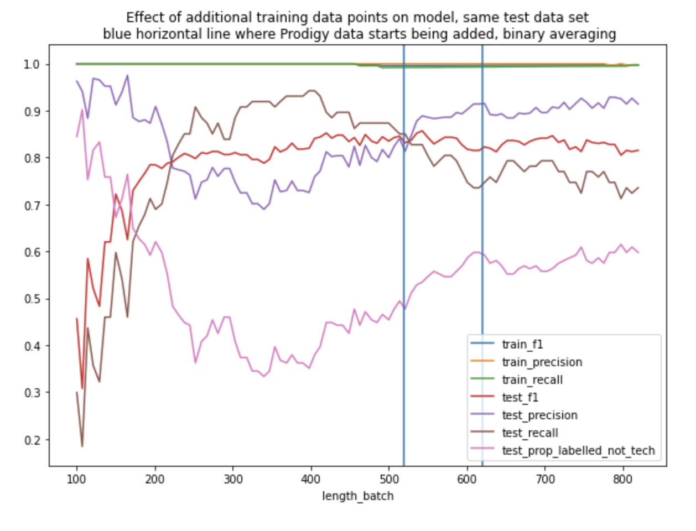
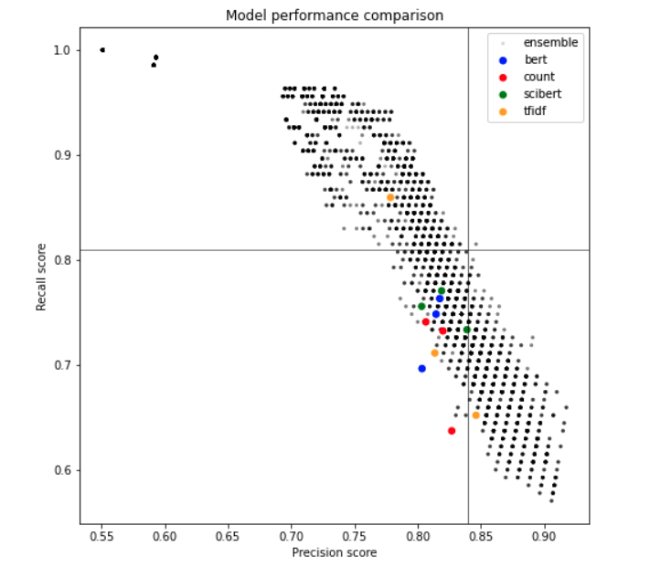

# Tagging Additional Training Data Using Prodigy

## Pre-processing

Since we have already tagged a training dataset, we first need to process this data into the JSONL format useful for Prodigy.

`notebooks/Get prodigy format data.ipynb` creates three datasets:
1. `data/prodigy/existing_training_data.jsonl`: The existing training data used for the 210129 Ensemble model
2. `data/prodigy/existing_test_data.jsonl`: The existing test data used for the 210129 Ensemble model
3. `data/prodigy/grants_data.jsonl`: All the grants data from from data/raw/wellcome-grants-awarded-2005-2019.csv

In each case all the texts (title+description) have been cleaned, deduplicated and descriptions with 'Not available' have been removed.


## Using Prodigy

Prodigy has a feature for active learning whilst tagging training data. This way we could tag additional training data in an intelligent way - focussing on tagging grants which the model will learn most from, e.g. edge case grants, or ones dissimilar to others.

```
make prodigy_virtualenv
source build/prodigy_virtualenv/bin/activate
```

Create a database and input the existing training data split (520 data points) into it.
```
prodigy dataset tech_grants_2 "Grants labelled with whether they are tech or not" --author Liz
prodigy db-in tech_grants_2 data/prodigy/existing_training_data.jsonl
```

Tag new data points (from the list created in `notebooks/Get prodigy format data.ipynb`) whilst actively learning which data points should be tagged next in order to make maximum gains at training a logistic regression model (custom recipe in nutrition_labels/prodigy_textcat_teach.py).
```
prodigy textcat.teach-tech tech_grants_2 data/prodigy/grants_data.jsonl --label 'Tech grant' -s "Low scoring tech grant predictions" -p "prefer_uncertain" -F nutrition_labels/prodigy_textcat_teach.py
```
This will give you a new score on the training and test data (in `data/prodigy/existing_test_data.jsonl`) every 10 annotations. The progress bar gives you the test F1 score - calculated on a hold out test dataset from `data/prodigy/existing_test_data.jsonl`, which wasn't imported as training data.

The optional "session_name" parameter can be changed with a useful tag for this bit of tagging, if not populated it will be filled with the date and time you started the session.

The optional "sorter" parameter is where you choose which Prodigy sorting method (see [here](https://prodi.gy/docs/api-components#sorters)) to use, by default this is `prefer_uncertain`.

## Tagging additions

All in the dataset `tech_grants_2`:

|session_name | Description | Number not ignored |
|---|---|---|
| Originally labelled training data | Without using Prodigy | 520 |
| Low scoring tech grant predictions | Using Prodigy with `prefer_uncertain` sorting | 100 |
| High scoring tech grant predictions | Using Prodigy with `prefer_high_scores` sorting | 200 |


## After tagging

When you have finished tagging save the dataset by running:
```
prodigy db-out tech_grants_2 data/prodigy/tech_grants_2
```

Then add the hold-out test dataset to it with:
```
prodigy dataset test_data "210129 Ensemble model test dataset" --author Liz
prodigy db-in test_data data/prodigy/existing_test_data.jsonl
prodigy db-merge tech_grants_2,test_data merged_tech_grants
prodigy db-out merged_tech_grants data/prodigy/merged_tech_grants
```

## What did Progigy add?

In the notebook `notebooks/Prodigy evaluation.ipynb` I looked at the difference the Prodigy data made to the performance of a TFIDF- logistic regression model. The following plot shows the train and test metrics as the training data increases in size (x-axis). x=0:520 is a random assortment of the originally tagged data, x=521:620 is the Prodigy actively learnt with `prefer_uncertain` sorting data tagging (in order), and x=621:820 is the Prodigy actively learnt with `prefer_high_scores` sorting data tagging (in order).



## 210218 training data

Since we tag the text with accept or reject 'tech model' or accept or reject 'not tech model', it's important to remember that an accept=False result means the opposite tag is true.

The Prodigy data needed reformatting to a format suitable for training data. This can be created by running:
```
python nutrition_labels/prodigy_training_data.py --prodigy_data_dir 'data/prodigy/merged_tech_grants/merged_tech_grants.jsonl'
```
which will output the training data in a datestamped folder.

This outputted the `data/processed/training_data/210221/training_data.csv` training dataset:

| Tag code | Meaning | Number of grants |
|---|---|--- |
| 1 | Relevant | 495 |
| 0 | Not relevant | 485 |

### Variability in the results:


I reran `grant_tagger_seed_experiments.py` with the training data in `data/processed/training_data/210221/training_data.csv`. This script trains several models with different random seeds and teamed with the `Seed variability.ipynb` notebook we can pick a new 'best' random seed to choose our training/test split for all models.

New results:

| Model | Mean/std/range test accuracy | Mean/std/range test f1 | Mean/std/range test precision_score | Mean/std/range test recall_score |
| ----- | ------------------ | ------------ | ------------------------- | ---------------------- |
|bert_SVM_bert_210221|0.769/0.011/(0.759, 0.796)|0.775/0.016/(0.755, 0.8)|0.785/0.034/(0.722, 0.828)|0.768/0.028/(0.718, 0.811)|
|bert_SVM_scibert_210221|0.765/0.017/(0.735, 0.8)|0.769/0.019/(0.743, 0.797)|0.791/0.052/(0.718, 0.856)|0.752/0.031/(0.721, 0.817)|
|bert_log_reg_bert_210221|0.756/0.022/(0.718, 0.788)|0.762/0.016/(0.737, 0.789)|0.777/0.026/(0.736, 0.817)|0.748/0.028/(0.696, 0.792)|
|bert_log_reg_scibert_210221|0.775/0.023/(0.739, 0.808)|0.779/0.021/(0.739, 0.807)|0.796/0.029/(0.75, 0.839)|0.765/0.039/(0.707, 0.817)|
|bert_naive_bayes_bert_210221|0.736/0.015/(0.71, 0.755)|0.738/0.018/(0.703, 0.766)|0.764/0.052/(0.677, 0.845)|0.717/0.027/(0.688, 0.754)|
|bert_naive_bayes_scibert_210221|0.762/0.02/(0.739, 0.8)|0.771/0.019/(0.745, 0.802)|0.774/0.043/(0.697, 0.837)|0.771/0.031/(0.714, 0.811)|
|count_SVM_210221|0.707/0.031/(0.665, 0.759)|0.696/0.029/(0.661, 0.749)|0.759/0.033/(0.705, 0.827)|0.646/0.055/(0.581, 0.765)|
|count_log_reg_210221|0.747/0.029/(0.706, 0.796)|0.751/0.025/(0.71, 0.781)|0.774/0.045/(0.703, 0.856)|0.732/0.033/(0.696, 0.783)|
|count_naive_bayes_210221|0.762/0.02/(0.731, 0.8)|0.787/0.02/(0.766, 0.816)|0.735/0.031/(0.691, 0.782)|0.849/0.03/(0.808, 0.896)|
|tfidf_SVM_210221|0.744/0.033/(0.694, 0.784)|0.736/0.038/(0.678, 0.789)|0.802/0.046/(0.728, 0.871)|0.689/0.093/(0.564, 0.861)|
|tfidf_log_reg_210221|0.75/0.029/(0.698, 0.784)|0.751/0.032/(0.692, 0.789)|0.784/0.047/(0.716, 0.876)|0.73/0.085/(0.593, 0.878)|
|tfidf_naive_bayes_210221|0.716/0.06/(0.588, 0.788)|0.766/0.037/(0.689, 0.817)|0.685/0.091/(0.533, 0.803)|0.887/0.068/(0.786, 0.974)|


### Best seed:
We calculated the highest average metrics over all models for the different random seeds used in `Seed variability.ipynb`.

The seed `1` gave good results, so we will use this in `grant_tagger.py`.

### Rerunning all models

We ran:

```
python nutrition_labels/grant_tagger.py --training_data_file 'data/processed/training_data/210221/training_data.csv' --vectorizer_type count --model_type naive_bayes --bert_type scibert
```
with the different values for vectorizer_type, model_type and bert_type.

A comparison with the previous results (201022 - old definition, 210128 - new definition but no additional Prodigy data):

| Date | Vectorizer type | Model type | Bert type (if relevant) | Train F1 | Test F1 | Test precision | Test recall |
| --- | --- | --- | --- | --- | --- | --- | --- |
| 201022 | count | log_reg | - | 1.000 | 0.842 | 0.814 | 0.873 |
| 210128 | count | log_reg | - | 1.000 | 0.795 | 0.787 | 0.805 |
| 210221 | count | log_reg | - | 1.000 | 0.772 | 0.806 | 0.741 |
| 201022 | count | naive_bayes | - | 1.000 | 0.864 | 0.810 | 0.927 |
| 210128 | count | naive_bayes | - | 1.000 | 0.827 | 0.743 | 0.931 |
| 210221 | count | naive_bayes | - |  1.000 | 0.774 | 0.820 | 0.732 |
| 201022 | count | SVM | - | 0.994 | 0.847 | 0.839 | 0.855 |
| 210128 | count | SVM | - | 0.981 | 0.786 | 0.791 | 0.782 |
| 210221 | count | SVM | - | 0.969 | 0.720 | 0.827 | 0.637 |
| 201022 | tfidf | log_reg | - | 1.000 | 0.844 | 0.852 | 0.836 |
| 210128 | tfidf | log_reg | - | 0.996 | 0.849 | 0.859 | 0.839 |
| 210221 | tfidf | log_reg | - | 0.997 | 0.759 | 0.814 | 0.711 |
| 201022 | tfidf | naive_bayes | - | 1.000 | 0.846 | 0.765 | 0.945 |
| 210128 | tfidf | naive_bayes | - | 1.000 | 0.830 | 0.735 | 0.954 |
| 210221 | tfidf | naive_bayes | - | 0.999 | 0.817 | 0.779 | 0.859 |
| 201022 | tfidf | SVM | - | 1.000 | 0.822 | 0.846 | 0.800 |
| 210128 | tfidf | SVM | - | 1.000 | 0.828 | 0.854 | 0.805 |
| 210221 | tfidf | SVM | - | 1.000 | 0.736 | 0.846 | 0.652 |
| 201022 | bert | naive_bayes | bert | 0.713 | 0.757 | 0.813 | 0.709 |
| 210128 | bert | naive_bayes | bert | 0.748 | 0.789 | 0.745 | 0.839 |
| 210221 | bert | naive_bayes | bert | 0.730 | 0.746 | 0.803 | 0.696 |
| 201022 | bert | SVM | bert | 0.819 | 0.881 | 0.825 | 0.945 |
| 210128 | bert | SVM | bert | 0.822 | 0.809 | 0.752 | 0.874 |
| 210221 | bert | SVM | bert | 0.803 | 0.780 | 0.815 | 0.748 |
| 201022 | bert | log_reg | bert | 1.000 | 0.825 | 0.797 | 0.855 |
| 210128 | bert | log_reg | bert | 1.000 | 0.775 | 0.758 | 0.793 |
| 210221 | bert | log_reg | bert | 0.993 | 0.789 | 0.817 | 0.763|
| 201022 | bert | naive_bayes | scibert | 0.772 | 0.796 | 0.811 | 0.782 |
| 210128 | bert | naive_bayes | scibert | 0.816 | 0.842 | 0.802 | 0.885 |
| 210221 | bert | naive_bayes | scibert | 0.764 | 0.779 | 0.803 | 0.756 |
| 201022 | bert | SVM | scibert | 0.776 | 0.879 | 0.904 | 0.855 |
| 210128 | bert | SVM | scibert | 0.831 | 0.851 | 0.819 | 0.885 |
| 210221 | bert | SVM | scibert | 0.793 | 0.783 | 0.839 | 0.733 |
| 201022 | bert | log_reg | scibert | 1.000 | 0.814 | 0.762 | 0.873 |
| 210128 | bert | log_reg | scibert | 1.000 | 0.775 | 0.758 | 0.793 |
| 210221 | bert | log_reg | scibert | 1.000 | 0.794 | 0.819 | 0.770 |

### Ensemble model

In the previous method we ran the script `ensemble_model.py` to make predictions using an ensemble of models which satisfied precision and recall value thresholds. However in this iteration we improved the process by testing which ensemble of models and which number of models that needs to agree is optimal.

We first make predictions using the test data for each of the 12 models. This is done by running:
```
python nutrition_labels/predict_tech.py 
    --training_data_file data/processed/training_data/210221/training_data.csv
    --grants_data_file data/raw/wellcome-grants-awarded-2005-2019.csv
    --models_date 210221
```

The ensemble parameter experiments were run in `notebooks/Ensemble parameter exploration.ipynb`. In this we plot the precision/recall for each of the 12 models plus every single combination of those 12 models for different values of the number of models that need to agree.



The models found with the 'best' recall and precision were:

- Ensemble of 3 models with 2 needing to agree ('bert_log_reg_bert_210221', 'bert_SVM_bert_210221', 'count_naive_bayes_210221')
- Ensemble of 4 models with 3 needing to agree ('bert_naive_bayes_bert_210221', 'bert_log_reg_bert_210221', 'bert_SVM_bert_210221', 'count_naive_bayes_210221')
- Ensemble of 4 models with 3 needing to agree ('bert_log_reg_bert_210221', 'bert_SVM_bert_210221', 'bert_naive_bayes_scibert_210221', 'count_naive_bayes_210221')
- Ensemble of 3 models with 4 needing to agree ('bert_naive_bayes_bert_210221', 'bert_log_reg_bert_210221', 'bert_SVM_bert_210221', 'bert_naive_bayes_scibert_210221', 'count_naive_bayes_210221')

out of these we chose the ensemble with:
- 3 models ('bert_log_reg_bert_210221', 'bert_SVM_bert_210221', 'count_naive_bayes_210221')
- 2 need to agree on the grant being a tech grant in order for final prediction to be tech.

we chose this since making predictions using fewer models is preferred in terms of time resource.

The classification report for this ensemble model is:

||precision|recall|f1-score|support|
|--|--|--|--|--|
|0|0.78|0.82|0.80|110|
|1|0.85|0.81|0.83|135|
|accuracy|||0.82|245|
|macro avg|0.81|0.82|0.82|245|
|weighted avg|0.82|0.82|0.82|245|

Finally these details were put into a config file and
```
python nutrition_labels/tech_grants_tagger.py --config_path configs/ensemble/2020.02.21.ini
```

was run to make predictions for all the grants.
