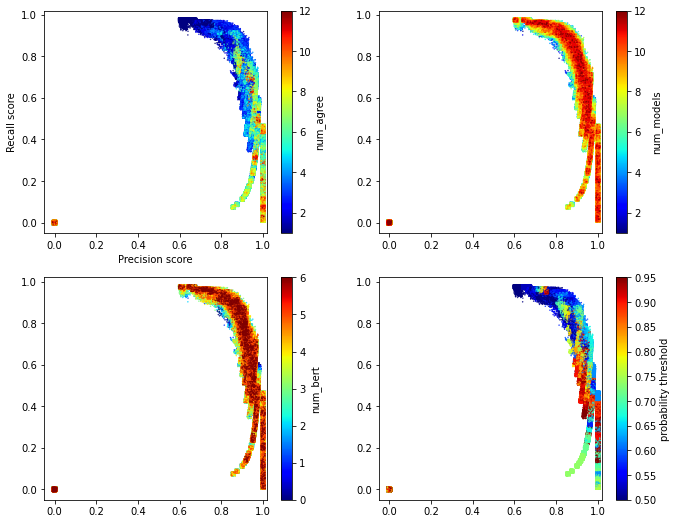
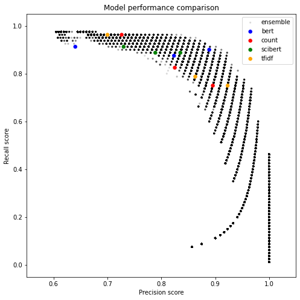

This document will describe the results of the tech grant model after some additional changes that were made to this project.

Firstly, the original training dataset has been expanded since the work done on this project in 2020.

# Training data

## 2020 Training data

The training data used in 2020 was the `200807/training_data.csv` version. This consisted of 214 tech grants and 883 not tech grants. The process of tagging this and model results are described in `docs/Finding_Tech_Grants.md`.

## Expanding the definition of tech

We then expanded the definition of 'tech' and retagged some of the original training data. This process is described in `docs/Expanding_tech_grants.md`. In summary the changes were:

| Data type | Previous number | New number | Difference |
| --- | --- | --- | --- |
| RF tech data points | 23 | 144 | +122 |
| EPMC tech data points | 143 | 191 | +48 |
| Grants tech data points | 111 | 164 | +53 |
| Grants not-tech data points | 1004 | 358| -646 |

This resulted in the `210126/training_data.csv` training data with 347 tech grants and 349 not tech grants.

## Tagging training data using active learning in Prodigy

We then added to the training data using active learning. This process is described in `docs/Prodigy_training_data.md`. This created the outputted the `210221/training_data.csv` dataset which consists of 495 tech grants and 485 not tech grants.

## Final training data set

After some experimentation we realised that the ResearchFish and EPMC data points negatively effect the performance of the model. However they are useful in evaluating how well the model extends to find the 'hidden tech'. These experiments are discussed in `Training_data_sources.md`. After some refactoring and changing how the text was cleaned slightly the final training data set used it the `210308/training_data.csv` version.

A summary and comparison of the data changes is as follows:

| Tag code | Meaning | Number of grants - 200807 | Number of grants - 210126 | Number of grants - 210221 | Number of grants - 210308|
|---|---|--- |--- | --- | --- |
| 1 | Tech grants | 214 |347 | 495 | 313 |
| 0 | Not tech grants | 883 |349 | 485 | 488 |


We also outputted some evaluation data using just the ResearchFish and EPMC data respectively. This by running `python nutrition_labels/create_training_data.py --config_path configs/training_data/2021.03.29.rf.ini` and `2021.03.29.epmc.ini` respectively.

# Training the models

The training data is then linked with text information about the grant. Usually this text comes from the publically available 360 giving dataset, and we include grant title, description and grant type. I experimented with using the 360 dataset vs data from grant tracker (42), and including the grant type or not, as well as cleaning the text in different ways.

## 42 data

Using the grant IDs given in the 2021.03.08 training data I queried our grants warehouse (42) to find the original grants text data. It's uncertain in what ways this data might be different to the 360 giving data, but it does appear to perform differently. Thus extra information about the training data is stored in `data/processed/fortytwo/tech_210308_training_data_fortytwo_info.csv`.

## Experiments

In `notebooks/Comparison of training experiments - March 2021.ipynb` I experiment with different model setups and whether the model's produced improve. Commonalities of these experiments are:
- Train/test on grants only data points (2021.03.08 training data)
- Same model parameters: relevant_sample_ratio = 1, test_size = 0.25, split_seed = 1, vectorizer_types = ['count', 'tfidf'], classifier_types = ['naive_bayes', 'SVM', 'log_reg']
- Evaluated on RF and EPMC data points (`2021.03.29.rf.ini` and `2021.03.29.epmc.ini` training data).
- Evaluated using 42 text data.

Experiments:

0. Baseline - `models/210316/`.
1. Remove stop words for count and tfidf vectorizers.
2. 1 + Don't train using grant types.
3. 1 + 2 + Apply clean_string to grants text.
4. 1 + Apply clean_string to grants text.
5. 1 + Apply clean_string to grants text + Train using fortytwo data (rather than usual 360 giving data).
6. 1 + Apply clean_string to grants text not including grant type + Train using fortytwo data (rather than usual 360 giving data).

There is quite a lot of variation in the results from the 6 different models (TFIDF + SVM, TFIDF + log_reg, ...). The trends remain the same regardless of experiment.


The average metrics of all models reveal that the best experiment is `remove stop words + clean strings + 42 training data` (experiment 5). This gives highest test recall and precision, and good EPMC evaluation metric.


It appears that the exclusion of the grant type data made the models perform worse. However, we felt that including grant type in the training may not extend well in a future where grant type names might change. Note that the difference in results between experiment 5 (including grant type with 42 data) and 6 (not including grant type with 42 data) isn't too drastic anyway.

|Metric (average of all models)| Experiment 0|Experiment 1  |Experiment 2   |Experiment 3   |Experiment 4   |Experiment 5   |Experiment 6|
|---|---|---|---|---|---|---|---|
|Train F1   |0.997  |0.999  |0.999  |1.000  |1.000  |0.999  |0.999|
|Test precision |0.791  |0.795  |0.792  |0.815  |0.822  |0.825  |0.822|
|Test recall    |0.829  |0.821  |0.810  |0.827  |0.833  |0.848  |0.840|
|Test precision (42)|0.797  |0.816  |0.816  |0.815  |0.822  |-  |-|
|42 Test recall (42)|0.867  |0.846  |0.844  |0.842  |0.844  |-  |-|
|EPMC accuracy  |0.676  |0.696  |0.687  |0.697  |0.706  |0.699  |0.691|
|RF accuracy    |0.514  |0.552  |0.540  |0.519  |0.524  |0.510  |0.510|

Note: When using the 42 data in the training the evaluation using 42 data is the same as the test metrics. Thus the 42 data evaluation is only really interesting to see how well the 360 giving data translates to 42 data.


## `grant_tagger.py` additions

Thus `grant_tagger.py` was adapted to:
- Remove stop words for count and tfidf vectorizers.
- Improved string cleaning of the training data.
- The random seed is set to 1. Earlier we tried to optimise the value picked for this, but then this would overfit to the test data - so this time it wasn't picked with any thought for optimisation.

A new model training config was made for training models (`configs/train_model/2021.04.01.ini`) which also takes the 42 grant data as an input to get the grant texts from and doesn't include grant type.

## Performance

I ran:
```
python nutrition_labels/grant_tagger.py --config_path configs/train_model/2021.04.01.ini
```

I evaluated how well each model extended to make predictions of tech grants on the RF and EPMC datasets by running:
```
python nutrition_labels/grant_tagger_evaluation.py --model_config configs/train_model/2021.04.01.ini --epmc_file_dir data/processed/training_data/210329epmc/training_data.csv --rf_file_dir data/processed/training_data/210329rf/training_data.csv
```
This script also outputs the test metrics for each model in one csv which gives:

| Date   | Vectorizer | Classifier  | f1    | precision_score | recall_score | EPMC accuracy | RF accuracy | High scoring |
|--------|------------|-------------|-------|-----------------|--------------|---------------|-------------|---|
| 210401 | count      | naive_bayes | 0.828 | 0.726           | 0.962        | 0.784         | 0.614       | x |
| 210401 | count      | SVM         | 0.816 | 0.896           | 0.75         | 0.568         | 0.386       ||
| 210401 | count      | log_reg     | 0.825 | 0.825           | 0.825        | 0.588         | 0.371       ||
| 210401 | tfidf      | naive_bayes | 0.811 | 0.7             | 0.962        | 0.818         | 0.671       | x |
| 210401 | tfidf      | SVM         | 0.828 | 0.923           | 0.75         | 0.649         | 0.414       ||
| 210401 | tfidf      | log_reg     | 0.824 | 0.863           | 0.788        | 0.709         | 0.457       | x |
| 210401 | bert       | naive_bayes | 0.836 | 0.812           | 0.862        | 0.872         | 0.671       | x |
| 210401 | bert       | SVM         | 0.85  | 0.816           | 0.888        | 0.642         | 0.486       ||
| 210401 | bert       | log_reg     | 0.864 | 0.854           | 0.875        | 0.595         | 0.457       ||
| 210401 | scibert    | naive_bayes | 0.845 | 0.807           | 0.888        | 0.797         | 0.557       | x |
| 210401 | scibert    | SVM         | 0.847 | 0.8             | 0.9          | 0.709         | 0.5         ||
| 210401 | scibert    | log_reg     | 0.852 | 0.841           | 0.862        | 0.669         | 0.5         ||

### Ensemble model

#### Parameter experiments

In `notebooks/Ensemble parameter exploration.ipynb` I look at different ensembles of these 12 models. The different parameters experimented with in this notebook are as follows:

1. The combination of models (`2**12 - 1 = 4095` options).
2. The probability threshold - if a model classifies a grant as tech with probability over a threshold then keep it classified as tech (varied between 0.5 and 0.95).
3. The number of models that need to agree on a grant being a tech grant in order to classify it as tech (between 1 and all the models in the combination).

By varying each of these 3 options I calculated the results of a total of 491,520 ensemble models. The precision and recall scores with a parameter varied are as follows (I introduced a small amount of randomness in the x and y axis since there were a lot of overlapping scores):



These can be plotted along with the original single models as follows (no randomness was included in this plot, and I've zoomed in):



In order to optimise having a large precision and recall, I selected the 96 ensemble models which had a precision score of 0.92 and a recall of 0.8625. From these I chose the one which had a minimum number of models with BERT or SciBERT vectorizers since these make the predictions take longer. Thus my favourite ensemble to use was:

1. Composed of the 3 models 'tfidf_SVM_210401', 'scibert_SVM_210401', 'scibert_log_reg_210401'
2. The prediction probability needs to be over 0.85 in each model for the model's classification to be tech.
3. 1 out of 3 needs to agree on a tech grant classification in order for the final classification to be tech.

This ensemble gives the following results on the test set:

||precision|recall |f1-score   |support|
|--|---|---|---|---|
|Not tech|0.87|0.92|0.89|77|
|Tech|0.92|0.86|0.89|80|
|accuracy|||0.89|157|
|macro avg|0.89|0.89|0.89|157|
|weighted avg|0.89|0.89|0.89|157|

||Predicted not tech| Predicted tech|
|---|---|---|
|Actually not tech|71 |6|
|Actually tech|11|69|
