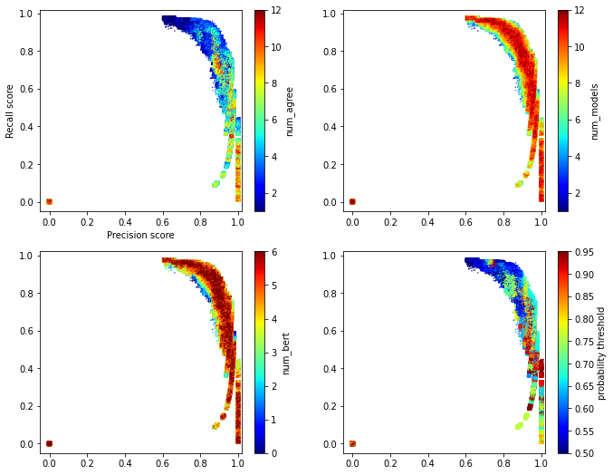
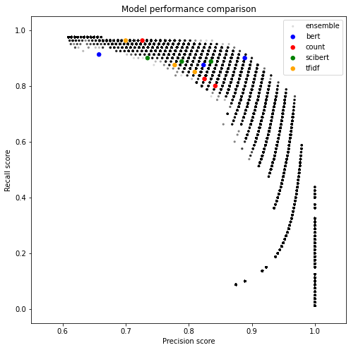
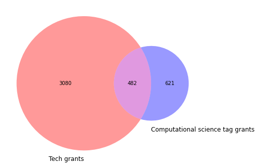
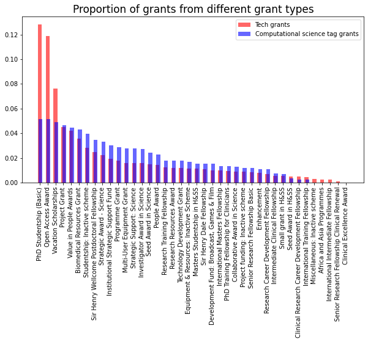
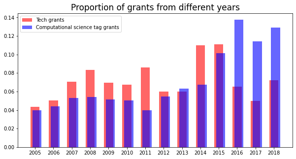
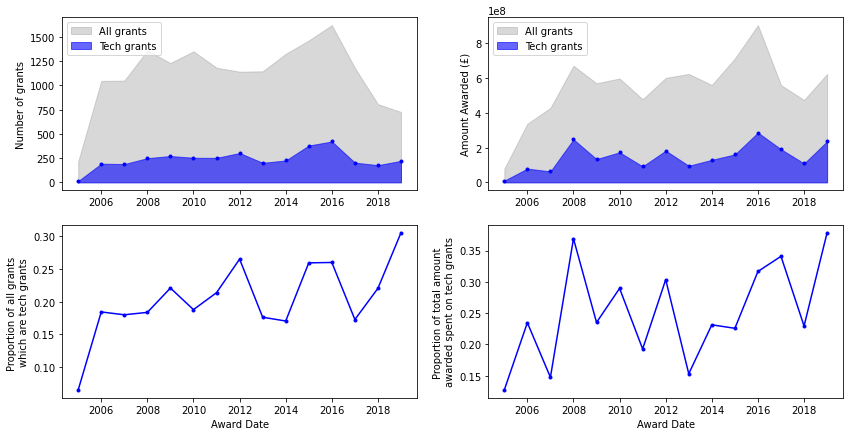
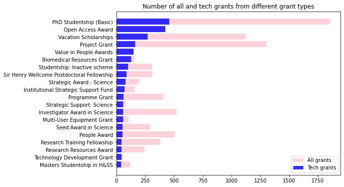
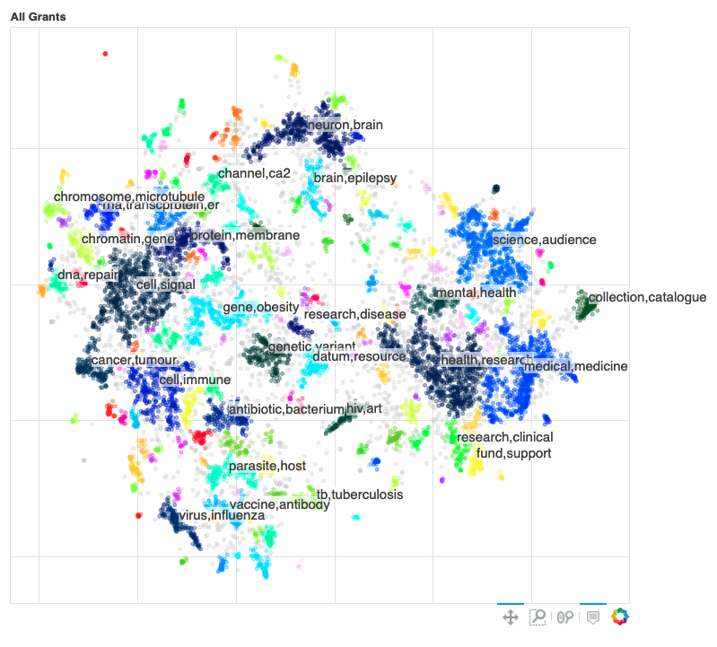
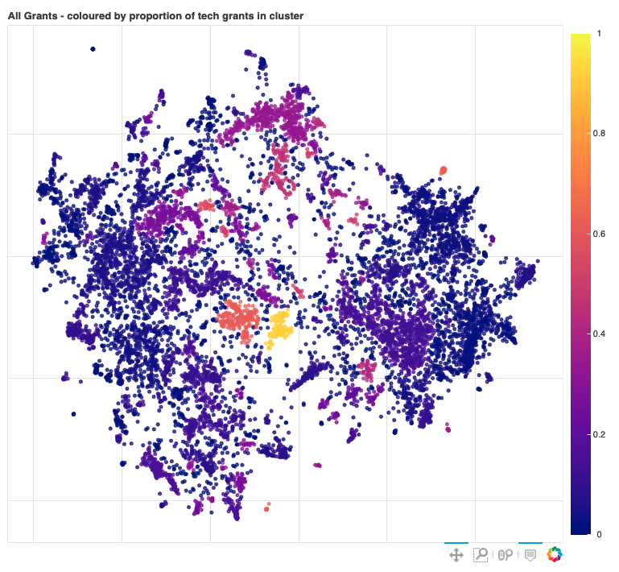
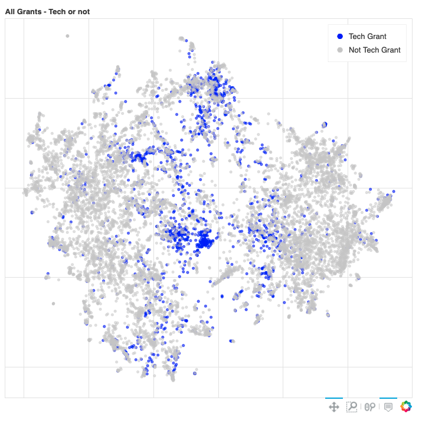

This document will describe the results of the tech grant model after some additional changes that were made to this project.

Firstly, the original training dataset has been expanded since the work done on this project in 2020.

# Training data

## 2020 Training data

The training data used in 2020 was the `200807/training_data.csv` version. This consisted of 214 tech grants and 883 not tech grants. The process of tagging this and model results are described in `docs/Finding_Tech_Grants.md`.

## Expanding the definition of tech

We then expanded the definition of 'tech' and retagged some of the original training data. This process is described in `docs/Expanding_tech_grants.md`. In summary the changes were:

| Data type | Previous number | New number | Difference |
| --- | --- | --- | --- |
| RF tech data points | 23 | 144 | +122 |
| EPMC tech data points | 143 | 191 | +48 |
| Grants tech data points | 111 | 164 | +53 |
| Grants not-tech data points | 1004 | 358| -646 |

This resulted in the `210126/training_data.csv` training data with 347 tech grants and 349 not tech grants.

## Tagging training data using active learning in Prodigy

We then added to the training data using active learning. This process is described in `docs/Prodigy_training_data.md`. This created the outputted the `210221/training_data.csv` dataset which consists of 495 tech grants and 485 not tech grants.

## Final training data set

After some experimentation we realised that the ResearchFish and EPMC data points negatively effect the performance of the model. However they are useful in evaluating how well the model extends to find the 'hidden tech'. These experiments are discussed in `Training_data_sources.md`. After some refactoring and changing how the text was cleaned slightly the final training data set used it the `210308/training_data.csv` version.

A summary and comparison of the data changes is as follows:

| Tag code | Meaning | Number of grants - 200807 | Number of grants - 210126 | Number of grants - 210221 | Number of grants - 210308|
|---|---|--- |--- | --- | --- |
| 1 | Tech grants | 214 |347 | 495 | 313 |
| 0 | Not tech grants | 883 |349 | 485 | 488 |


We also outputted some evaluation data using just the ResearchFish and EPMC data respectively. This by running `python nutrition_labels/create_training_data.py --config_path configs/training_data/2021.03.29.rf.ini` and `2021.03.29.epmc.ini` respectively.

# Training the models

The training data is then linked with text information about the grant. Usually this text comes from the publically available 360 giving dataset, and we include grant title, description and grant type. I experimented with using the 360 dataset vs data from grant tracker (42), and including the grant type or not, as well as cleaning the text in different ways.

## 42 data

Using the grant IDs given in the 2021.03.08 training data I queried our grants warehouse (42) to find the original grants text data. It's uncertain in what ways this data might be different to the 360 giving data, but it does appear to perform differently. Thus extra information about the training data is stored in `data/processed/fortytwo/tech_210308_training_data_fortytwo_info.csv`.

## Experiments

In `notebooks/Comparison of training experiments - March 2021.ipynb` I experiment with different model setups and whether the model's produced improve. Commonalities of these experiments are:
- Train/test on grants only data points (2021.03.08 training data)
- Same model parameters: relevant_sample_ratio = 1, test_size = 0.25, split_seed = 1, vectorizer_types = ['count', 'tfidf'], classifier_types = ['naive_bayes', 'SVM', 'log_reg']
- Evaluated on RF and EPMC data points (`2021.03.29.rf.ini` and `2021.03.29.epmc.ini` training data).
- Evaluated using 42 text data.

Experiments:

0. Baseline - `models/210316/`.
1. Remove stop words for count and tfidf vectorizers.
2. 1 + Don't train using grant types.
3. 1 + 2 + Apply clean_string to grants text.
4. 1 + Apply clean_string to grants text.
5. 1 + Apply clean_string to grants text + Train using fortytwo data (rather than usual 360 giving data).
6. 1 + Apply clean_string to grants text not including grant type + Train using fortytwo data (rather than usual 360 giving data).

There is quite a lot of variation in the results from the 6 different models (TFIDF + SVM, TFIDF + log_reg, ...). The trends remain the same regardless of experiment.


The average metrics of all models reveal that the best experiment is `remove stop words + clean strings + 42 training data` (experiment 5). This gives highest test recall and precision, and good EPMC evaluation metric.


It appears that the exclusion of the grant type data made the models perform worse. However, we felt that including grant type in the training may not extend well in a future where grant type names might change. Note that the difference in results between experiment 5 (including grant type with 42 data) and 6 (not including grant type with 42 data) isn't too drastic anyway.

|Metric (average of all models)| Experiment 0|Experiment 1  |Experiment 2   |Experiment 3   |Experiment 4   |Experiment 5   |Experiment 6|
|---|---|---|---|---|---|---|---|
|Train F1   |0.997  |0.999  |0.999  |1.000  |1.000  |0.999  |0.999|
|Test precision |0.791  |0.795  |0.792  |0.815  |0.822  |0.825  |0.822|
|Test recall    |0.829  |0.821  |0.810  |0.827  |0.833  |0.848  |0.840|
|Test precision (42)|0.797  |0.816  |0.816  |0.815  |0.822  |-  |-|
|42 Test recall (42)|0.867  |0.846  |0.844  |0.842  |0.844  |-  |-|
|EPMC accuracy  |0.676  |0.696  |0.687  |0.697  |0.706  |0.699  |0.691|
|RF accuracy    |0.514  |0.552  |0.540  |0.519  |0.524  |0.510  |0.510|

Note: When using the 42 data in the training the evaluation using 42 data is the same as the test metrics. Thus the 42 data evaluation is only really interesting to see how well the 360 giving data translates to 42 data.


## `grant_tagger.py` additions

Thus `grant_tagger.py` was adapted to:
- Remove stop words for count and tfidf vectorizers.
- Improved string cleaning of the training data.
- The random seed is set to 1. Earlier we tried to optimise the value picked for this, but then this would overfit to the test data - so this time it wasn't picked with any thought for optimisation.

A new model training config was made for training models (`configs/train_model/2021.04.01.ini`) which also takes the 42 grant data as an input to get the grant texts from and doesn't include grant type.

## Performance

I ran:
```
python nutrition_labels/grant_tagger.py --config_path configs/train_model/2021.04.02.ini
```

I evaluated how well each model extended to make predictions of tech grants on the RF and EPMC datasets by running:
```
python nutrition_labels/grant_tagger_evaluation.py --model_config configs/train_model/2021.04.02.ini --epmc_file_dir data/processed/training_data/210329epmc/training_data.csv --rf_file_dir data/processed/training_data/210329rf/training_data.csv
```
This script also outputs the test metrics for each model in one csv which gives:

| Date   | Vectorizer | Classifier  | f1    | precision_score | recall_score | EPMC accuracy | RF accuracy |
|--------|------------|-------------|-------|-----------------|--------------|---------------|-------------|
| 210402 | count      | naive_bayes | 0.828 | 0.726           | 0.962        | 0.784         | 0.614       |
| 210402 | count      | SVM         | 0.821 | 0.842           | 0.8          | 0.568         | 0.386       |
| 210402 | count      | log_reg     | 0.825 | 0.825           | 0.825        | 0.588         | 0.371       |
| 210402 | tfidf      | naive_bayes | 0.811 | 0.7             | 0.962        | 0.811         | 0.657       |
| 210402 | tfidf      | SVM         | 0.829 | 0.81            | 0.85         | 0.662         | 0.429       |
| 210402 | tfidf      | log_reg     | 0.824 | 0.778           | 0.875        | 0.736         | 0.457       |
| 210402 | bert       | naive_bayes | 0.764 | 0.658           | 0.912        | 0.838         | 0.614       |
| 210402 | bert       | SVM         | 0.848 | 0.824           | 0.875        | 0.642         | 0.457       |
| 210402 | bert       | log_reg     | 0.894 | 0.889           | 0.9          | 0.628         | 0.4         |
| 210402 | scibert    | naive_bayes | 0.809 | 0.735           | 0.9          | 0.791         | 0.643       |
| 210402 | scibert    | SVM         | 0.835 | 0.789           | 0.888        | 0.75          | 0.514       |
| 210402 | scibert    | log_reg     | 0.861 | 0.835           | 0.888        | 0.689         | 0.5         |


### Ensemble model

#### Parameter experiments

In `notebooks/Ensemble parameter exploration.ipynb` I look at different ensembles of these 12 models. The different parameters experimented with in this notebook are as follows:

1. The combination of models (`2**12 - 1 = 4095` options).
2. The probability threshold - if a model classifies a grant as tech with probability over a threshold then keep it classified as tech (varied between 0.5 and 0.95).
3. The number of models that need to agree on a grant being a tech grant in order to classify it as tech (between 1 and all the models in the combination).

By varying each of these 3 options I calculated the results of a total of 491,520 ensemble models. The precision and recall scores with a parameter varied are as follows (I introduced a small amount of randomness in the x and y axis since there were a lot of overlapping scores):



These can be plotted along with the original single models as follows (no randomness was included in this plot, and I've zoomed in):



There were 15 ensemble models which gave a precision and recall score of 0.9. To select from these I wanted to pick ones that required less processing time - which boiled down to how many BERT based models there were in the ensemble. Thus the 4 models with <=2 BERT based models were:

|Models in ensemble | Number of models | Number that need to agree | Threshold | Precision | Recall | EPMC accuracy |	RF accuracy| Unused accuracy|
| --- | --- |  --- | --- | --- |---|--- |---|---|
|bert_log_reg|**1**|1|0.55|0.9|0.9|**0.61**	|**0.4**|0.87|
|count_naive_bayes, bert_log_reg|2|2|0.55|0.9|0.9|0.55	|**0.4**|0.90|
|count_naive_bayes, tfidf_naive_bayes, bert_SVM, bert_log_reg |4|2|0.67|0.9|0.9|0.47|	0.27|**0.94**|
|count_naive_bayes, tfidf_naive_bayes, tfidf_log_reg, bert_SVM, bert_log_reg|5|2|0.67|0.9|0.9|0.47	|0.27|**0.94**|

Note that the EPMC dataset was composed of 148 tech grants, the Research Fish composed of 70 tech grants and the unused data is 175 not tech grants.

Thus, the ensemble model I felt best to use going forward was:
1. Composed of 1 model 'bert_log_reg_210402'
2. The prediction probability needs to be over 0.55 in each model for the model's classification to be tech.
3. 1 out of 1 needs to agree on a tech grant classification in order for the final classification to be tech.

#### Evaluation

Running:
```
python nutrition_labels/evaluate.py --config_path configs/evaluation/2021.04.02.ini
```
will evaluate the model on the test, not seen data (if there was any), and the EPMC and RF evaluation data. This will work for configs with one model in, or multiple. The output file `data/processed/ensemble/210402/evaluation_results.txt` is stored.

This ensemble gives the following results on the test set:

||precision|recall |f1-score   |support|
|--|---|---|---|---|
|Not tech|0.90|0.90|0.90|77|
|Tech|0.90|0.90|0.90|80|
|accuracy|||0.90|157|
|macro avg|0.90|0.90|0.90|157|
|weighted avg|0.90|0.90|0.90|157|

||Predicted not tech| Predicted tech|
|---|---|---|
|Actually not tech|69 |8|
|Actually tech|8|72|

- 61% of grants identified as producing tech via EPMC data was also classified as producing tech from the grant description.
- 40% of grants identified as producing tech via ResearchFish data was also classified as producing tech from the grant description.
- 87% of grants identified as not producing tech, but not used in the training or test data, was classified correctly as so.

Running:
```
python nutrition_labels/predict.py --config_path configs/predict/2021.04.02.ini
```
will predict tech grants for the dataset given in the `grants_data_path` config variable.

#### Evaluation on model trained with 360Giving data

```
python nutrition_labels/evaluate.py --config_path configs/evaluation/2021.04.04.ini
```
When training on 360Giving data, the evaluation results on the test dataset are exactly the same as above. The results for evaluation on RF/not used were also the same, but the EPMC evaluation dropped to 58%.

### Results

Results discussed here will be for both the `configs/predict/2021.04.06.ini` model predictions - which is trained and predicted on the 360Giving open dataset, and the `configs/predict/2021.04.03.ini` model predictions - which is trained and predicted on all the grant data from FortyTwo, as downloaded on 20th April 2021.

The results for these two models/predictions are very similar - so we will comment on both, but give additional information (e.g. plots) for the 360Giving version since this is reproducible externally too.

#### Number of tech grants predicted

The `configs/predict/2021.04.06.ini` config file contains the path to the 360Giving dataset of 16,914 grants. The model predicted that 21% (3572) of these are tech grants - these tagged grants are stored in `data/processed/predictions/210406/wellcome-grants-awarded-2005-2019_tagged.csv`. This took about 3 hours to predict on my machine.

The `configs/predict/2021.04.03.ini` config file contains the path to all the grant data from fortytwo, as downloaded on 20th April 2021, this contains 126,341 grants. The model predicted that 12% (15199) of these are tech grants - these tagged grants are stored in `data/processed/predictions/210403/all_grants_fortytwo_info_210420_tagged.csv`. This took about 12 hours to predict on my machine.

16,853 grants were in both the 360Giving and 42 datasets - the predictions for these were the same 94% of the time.

#### Fairness

The predictions on the test data set were the same for both the 360 and the 42 datasets, so the fairness results will be the same for both.

Using both the 360 giving data and the 42 grants data in `notebooks/Fairness - 210420.ipynb` the predictions from the model in `data/processed/predictions/210406/wellcome-grants-awarded-2005-2019_tagged.csv` and `data/processed/predictions/210403/all_grants_fortytwo_info_210420_tagged.csv` give the follow group fairness results when grouped by universities (golden triangle or not), organisation region (London, other UK, or international), financial year, length of grant title+description given (which is the data which is predicted on):

| Data type | Type | Train ratio | Sample size | accuracy | f1 | precision_score | recall_score |
|-|-|-|-|-|-|-|-|
| Recipient organisation | Golden triangle | 0.371 | 69 | 0.913 | 0.925 | 0.925 | 0.925 |
| Recipient organisation | Not golden triangle | 0.629 | 88 | 0.886 | 0.875 | 0.875 | 0.875 |

| Data type | Type | Train ratio | Sample size | accuracy | f1 | precision_score | recall_score |
|-|-|-|-|-|-|-|-|
| Region grouped | Greater London | 0.311 | 59 | 0.932 | 0.937 | 0.968 | 0.909 |
| Region grouped | International | 0.09 | 12 | 0.917 | 0.909 | 0.833 | 1 |
| Region grouped | UK, not greater London | 0.599 | 86 | 0.872 | 0.871 | 0.86 | 0.881 |

| Data type | Type | Train ratio | Sample size | accuracy | f1 | precision_score | recall_score |
|-|-|-|-|-|-|-|-|
| Recipient Org:Country grouped | Not UK | 0.113 | 15 | 0.933 | 0.923 | 0.857 | 1 |
| Recipient Org:Country grouped | UK | 0.887 | 142 | 0.894 | 0.898 | 0.904 | 0.892 |

| Data type | Type | Train ratio | Sample size | accuracy | f1 | precision_score | recall_score |
|-|-|-|-|-|-|-|-|
| Financial Year grouped | <2010 | 0.068 | 8 | 1 | 1 | 1 | 1 |
| Financial Year grouped | 2010-2015 | 0.275 | 48 | 0.833 | 0.8 | 0.941 | 0.696 |
| Financial Year grouped | 2015-2017 | 0.324 | 45 | 0.933 | 0.936 | 0.88 | 1 |
| Financial Year grouped | >=2017 | 0.333 | 56 | 0.911 | 0.928 | 0.889 | 0.97 |

| Data type | Type | Train ratio | Sample size | accuracy | f1 | precision_score | recall_score |
|-|-|-|-|-|-|-|-|
| Title plus Description length binned | (0, 1000] | 0.064 | 12 | 0.917 | 0.857 | 0.75 | 1 |
| Title plus Description length binned | (1000, 1500] | 0.409 | 67 | 0.866 | 0.862 | 0.875 | 0.848 |
| Title plus Description length binned | (1500, 2000] | 0.435 | 67 | 0.925 | 0.933 | 0.921 | 0.946 |
| Title plus Description length binned | (2000, 3000] | 0.07 | 9 | 0.889 | 0.909 | 1 | 0.833 |
| Title plus Description length binned | (3000, 3798] | 0 | 2 | 1 | 1 | 1 | 1 |

We see the model performs considerably better for golden triangle universities over non-golden triangle, and London over not-London universities. As perhaps would be expected the model performs better when there is more text given to predict on.

### Comparison with science tags

Wellcome also has a model for tagging grants (we'll call this "the Science tags") with, so we wanted to compare our tech grant tags with theirs. We normalised both sets of data so that the same range of years were used (2005-2019). The Science tags include many different topics, and we selected the 'techy' topic tags: Data Science, Computational & Mathematical Modelling and/or Surveillance (we’ll call these the computational science tag grants).​ The Science tags come with a probability, and we were advised to only include the tags where the probability is over 0.4. This comparison was done in the notebook `Science tags - Tech grant comparison - 210420.ipynb`.

This analysis was performed on both the 360 giving data and the 42 data, however the results were very similar in terms of proportions - I'll just give the results of the 360 giving data here.

In general there wasn't a huge overlap between the two sets of tags, as seen in the venn plot:



A deeper dive showed that the proportions of grant types in both sets of tags would have been broadly similar had it not been skewed by a large number of PhD studentships in the tech grants but not in the computational science tags. Furthermore, looking at the proportion of grants in both sets of tags by grant year showed that there are more recent grants in the computational science tags.





### Broad analysis of tech grants

The results in this section are using the 360 Giving dataset - the tech grant predictions from `data/processed/predictions/210406/wellcome-grants-awarded-2005-2019_tagged.csv` (model trained on 360 Giving dataset). These were found in `notebooks/Tech Grants Summary Analysis.ipynb`.

- There were 3562 tech grants predicted in 16,854 grants (duplicates deleted) - 21.13%
- The amount awarded for tech grants was £2,191,601,015 out of £8,226,246,517 total funding for these grants  - 26.64%
- The largest number of tech grants occurred in 2016 - this was 422 grants which was 26% of the grants for that year, and 32% (£286,568,020) of the total spending for that year.
- The largest proportion of tech grants in all the grants occurred in 2019 - this was 222 grants which was 31% of the grants for that year, and 38% (£236,201,887) of the total spending for that year.
- PhD Studentship (Basic) Awards are the most common grant type with tech grants in - there are 458 of these in the tech grants. In all of this type of grant 25% are tech grants (458 out of 1856).
- Open Access Awards are the second most common grant type with tech grants in - there are 424 of these in the tech grants. In all of this type of grant 99% are tech grants (424 out of 428).
- Value in People Awards have the highest proportion of tech grants in - 150 of 150 (100%) of these are tech grants.
- Biomedical Resources Grants have the 4th highest proportion of tech grants in - 127 of 159 (80%) of these are tech grants.
- Strategic Support: Science grants have the 5th highest proportion of tech grants in - 56 of 74 (76%) of these are tech grants.
- Technology Development Grants have the 6th highest proportion of tech grants in - 42 of 57 (74%) of these are tech grants.






### Broad analysis of tech grants - FortyTwo data

The results in this section are using the fortytwo dataset - the tech grant predictions from `data/processed/predictions/210402/all_grants_fortytwo_info_210420_tagged.csv` (model trained on 42 Giving dataset). These were found in `notebooks/Tech Grants Summary Analysis - Internal data.ipynb`.
These results are all very similar to the 360Giving summary above.

- There were 2994 tech grants predicted in 16854 grants - 17.76%
- The amount awarded for tech grants was £1,969,715,337 out of £8,226,246,517 total funding for these grants  - 23.94%
- The largest number of tech grants occurred in 2016 - this was 361 grants which was 22% of the grants for that year, and 28% (£258,085,938) of the total spending for that year.
- The largest proportion of tech grants in all the grants occurred in 2019 - this was 207 grants which was 29% of the grants for that year, and 36% (£227,268,620) of the total spending for that year.

- Open Access Awards are the most common grant type with tech grants in - there are 422 of these in the tech grants. In all of this type of grant 99% are tech grants (422 out of 428).
- PhD Studentship (Basic) Awards are the 2nd most common grant type with tech grants in - there are 317 of these in the tech grants. In all of this type of grant 17% are tech grants (317 out of 1856).
- Value in People Awards have the highest proportion of tech grants in - 150 of 150 (100%) of these are tech grants.
- Biomedical Resources Grants have the 3rd highest proportion of tech grants in - 126 of 159 (79%) of these are tech grants.
- Technology Development Grants have the 4th highest proportion of tech grants in - 43 of 57 (75%) of these are tech grants.
- Strategic Support: Science grants have the 5th highest proportion of tech grants in - 53 of 74 (72%) of these are tech grants.


### Cluster Analysis

The results in this section are using the 360 Giving dataset. Clusters were found by running:
```
python nutrition_labels/cluster_tech_grants.py --config_path 'configs/clustering/2021.04.01.ini'
```
In `notebooks/Tech Grant Clusters Visualisation - 26 April 2021.ipynb` these clusters are analysed.

Firstly the data was reduced into 2D using TF-IDF vectorization and the UMAP dimensionality reduction algorithm. This 2D representation of the data is useful in visualisations. The dbscan clustering algorithm is then applied to this data. 173 clusters were found in all the grants.

In the following plot the clusters are coloured, and the clusters with >80 grants in have also been labelled with their top 2 keywords:



We can also colour the points by the proportion of tech grants in each cluster:



Or similarly, colour the point by whether it is a tech grant or not:



The 10 clusters with the highest proportion of tech grants were:

|Cluster number|Proportion of Tech Grants|Number of Grants|Keywords|
|---|----|---|---|
|7	|0.50|10|	language,stroke,recovery,aphasia,patient,task,aphasic,neuronal,damage,speech|
|	148	|0.50|	8|	stroke,hai,patient,treatment,dar,ssa,dysphagia,case,wgas,salaam|
|58	|0.50|	12|	asd,autism,disorder,spectrum,child,young,social,model,developmental,mouse|
|30	|0.50|16|	cvd,risk,cardiovascular,country,factor,disease,pune,healthcare,lac,adult|
|84	|0.50|20|	flow,cell,cytometry,sorter,cytometer,research,biology,facility,parameter,chromosome|
|39	|0.56|	39|	cryo,em,electron,resolution,macromolecular,structure,facility,microscopy,structural,microscope|
|6	|0.60|206|	genetic,variant,genome,sequence,datum,locus,association,disease,genotype,study|
|5|	0.63|24|	game,player,world,virtual,3d,immerse,vr,star,pet,story|
|166|	0.63|	8|	zikv,zika,congenital,microcephaly,infection,chikv,vietnam,brazil,syndrome,campina|
|34	|0.91|110|	datum,resource,database,twin,access,analysis,open,cohort,software,research|

The 10 clusters with the lowest proportion of tech grants were:

|Cluster number|Proportion of Tech Grants|Number of Grants|Keywords|
|---|----|---|---|
|129|	0.000	|32|	trypanosome,vsg,tsetse,brucei,stumpy,fly,expression,gene,parasite,cell|
|121	|0.000|	38|	hif,hypoxia,oxygen,hypoxic,vhl,response,hydroxylase,cell,pathway,inducible|
|113|	0.000	|45|	pain,dorsal,chronic,spinal,horn,neuropathic,peripheral,neuron,nociceptive,sensory|
|109	|0.000|	31|	replication,dna,origin,fork,replisome,helicase,cell,genome,duplication,eukaryotic|
|45	|0.012|	81	|dna,repair,damage,protein,ddr,repeat,cell,break,dsb,hr|
|21	|0.017|	757|	medical,medicine,history,conference,research,health,practice,modern,century,work|
|104|	0.019	|54	|nk,cell,hcmv,hla,kir,htlv,infection,hcv,latency,trophoblast|
|93	|0.020	|49|	war,forensic,military,medical,british,veteran,world,medicine,project,history|
|127	|0.021|	48|	secretion,effector,host,salmonella,cell,bacterial,protein,pathogen,t3ss,virulence|
|79	|0.022|	93|	chromosome,microtubule,segregation,meiosis,mitotic,spindle,cell,cohesin,centrosome,oocyte|


We also applied the dimensionality reduction and clustering on just the tech grants. 30 clusters were found when just clustering on the tech grants only.


The tech clusters with the largest number of grants in were:

|Cluster number|Number of Grants|Keywords|
|---|----|---|
|5	|294|	brain,model,neural,neuron,visual,network,process,task,learn,decision|
|0|	230|	gene,genome,sequence,variant,datum,analysis,disease,study,phenotype,method|
|2	|193|	health,research,datum,policy,intervention,care,population,change,public,mortality|
|8|	164|	virus,transmission,malaria,infection,host,datum,disease,influenza,model,pathogen|
4	|132|	protein,structural,structure,ms,mass,cryo,membrane,complex,proteomics,high|
|12	|117|	datum,patient,hospital,risk,health,disease,study,cohort,cvd,care|
|7|	60	|cell,image,tissue,stem,fate,flow,progenitor,model,single,high|
|13	|41|	coronary,cardiac,heart,patient,pressure,flow,artery,myocardial,drug,blood|
|9	|39|	datum,database,resource,community,open,research,platform,access,tool,intermine|
|10	|25|	asd,delirium,disorder,cognitive,dementia,ds,adhd,autism,people,spectrum|
