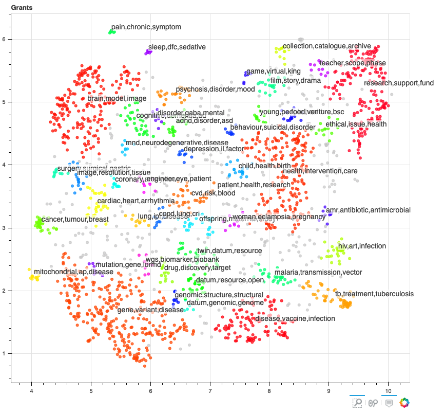
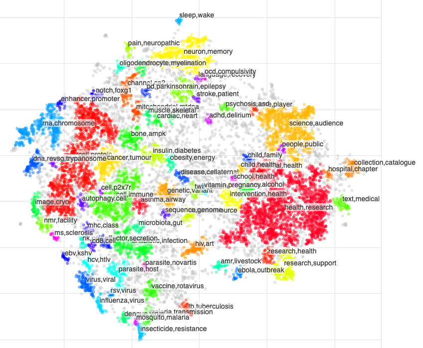
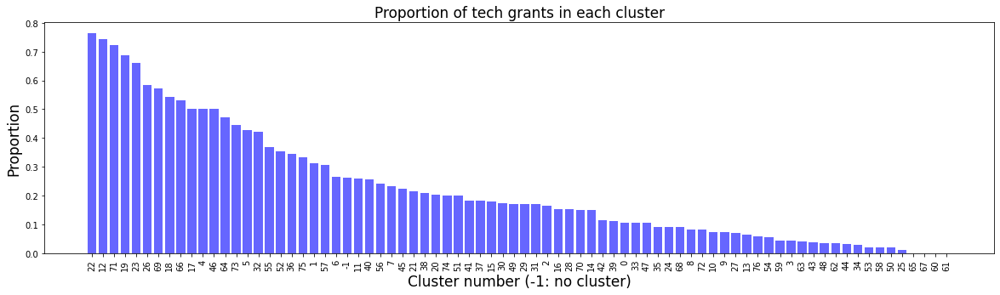
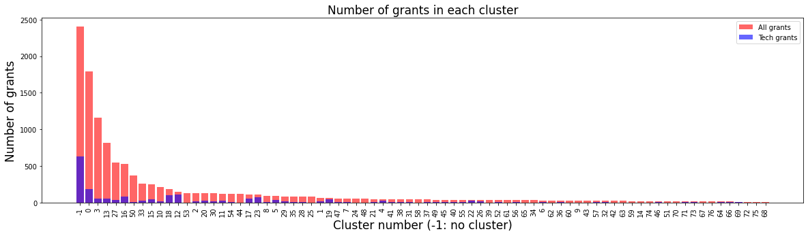
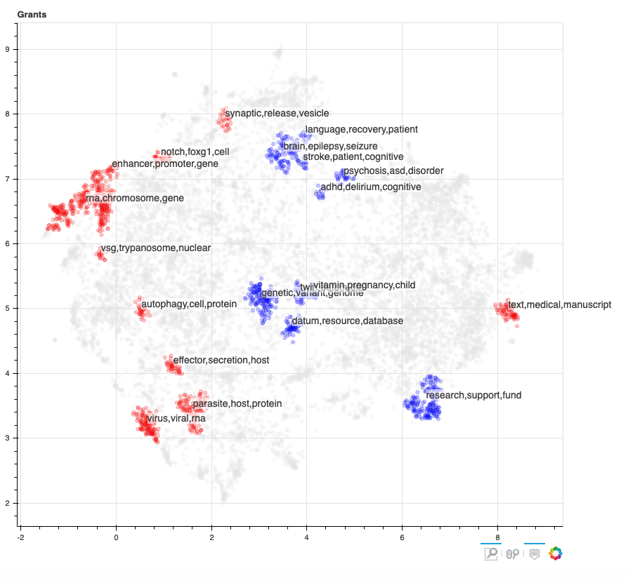

# Clustering tech grants

We want to be able to visualise where the tech grants sit in Wellcome's entire portfolio.

## Parameter tuning

We used the [`TextClustering`](https://github.com/wellcometrust/WellcomeML/blob/master/wellcomeml/ml/clustering.py) class from WellcomeML to reduce and cluster our the grants text. To use this we needed to pick parameters that both reduced the data well, and generates reasonable clusters. We wanted to cluster both the entire portfolio, and also just the tech grants.

In general, we vectorised the grants text data using TF-IDF. We reduced this data down to 2D using [UMAP dimensionality reduction](https://umap-learn.readthedocs.io/en/latest/), then we clustered this vectorised and reduced data using the [DBSCAN](https://en.wikipedia.org/wiki/DBSCAN) clustering algorithm.

Picking parameters for this task is in some ways a subjective task. Thus by trial and error we found parameters that produced reasonable looking clusters of the grants data. These are:

| Data | Method | Parameter | Value |
| --- |---|---|---|
| All grants | UMAP | metric | cosine |
| All grants | UMAP | min_dist | 0.05 |
| All grants | UMAP | n_neighbors | 30 |
| All grants | DBSCAN | min_samples | 18 |
| All grants | DBSCAN | eps | 0.12 |
| Tech grants | UMAP | metric | cosine |
| Tech grants | UMAP | min_dist | 0 |
| Tech grants | UMAP | n_neighbors | 30 |
| Tech grants | DBSCAN | min_samples | 8 |
| Tech grants | DBSCAN | eps | 0.15 |

## Clustering the data

The data is clustered by running:
```
python nutrition_labels/cluster_tech_grants --config_path 'configs/clustering/2020.11.25.ini'
```
where the config file contains the parameters and the file paths for the data to cluster.

In this the description for each grant is cleaned and grants with short descriptions are filtered out. Duplicates of grants with the same 6 digit ID are also removed since often for these the same description is used. Then the clustering algorithm is applied. 11,996 grants made it through this filtering.

This produces 3 files:
1. `models/clustering/grants_clusters_{datestamp}.pkl`
2. `models/clustering/tech_grants_clusters_{datestamp}.pkl`
3. `data/processed/cluster_grant_data_{datestamp}.csv`

The first 2 being the clusters for all the grants and just the tech grants respectively, and the third being the cleaned and deduplicated grants data with the clusters information.

Using this information, in `Tech Grant Clusters Visualisation.ipynb` we produce the visualisations and analyse these clusters.

This is a still from the tech grants clusters:



This is a still from all the grants clusters:



The top 2 or 3 words highest ranking words using TF-IDF for each cluster is given as the label for each cluster.

## Where do the tech grants sit in the whole portfolio?

Again, in `Tech Grant Clusters Visualisation.ipynb` we look at the 'most' and 'least' techy clusters - i.e. the clusters with the highest and lowest proportions of tech grants.

There are 76 clusters with varying proportions of tech grants:




We can visualise the grant clusters with the most (blue) and least (red) techy grants highlighted:



And in more detail, the top 5 most tech grants:

| Keywords | Number grants 	| Number tech grants 	| Proportion tech grants 	|
|-	|-	|-	|-	|
| twin,datum,000,resource,sample,linkage,cohort,... 	| 38 	| 29 	| 0.763 	|
| genetic,variant,genome,association,genotype,da... 	| 152 	| 113 	| 0.743 	|
| adhd,delirium,cognitive,disorder,neurodevelopm... 	| 18 	| 13 	| 0.722 	|
| datum,resource,database,software,access,analys... 	| 64 	| 44 	| 0.688 	|
| brain,epilepsy,seizure,mri,neuroimaging,model,... 	| 109 	| 72 	| 0.661 	|

The top 5 least tech grants:

| Keywords  | Number grants 	| Number tech grants 	| Proportion tech grants 	|
|-	|-	|-	|-	|
| text,medical,manuscript,medieval,galen,edition... 	| 82 	| 1 	| 0.012 	|
| autophagy,cell,protein,cgmp,cftr,pathway,signa... 	| 33 	| 0 	| 0 	|
| vsg,trypanosome,nuclear,expression,brucei,prot... 	| 18 	| 0 	| 0	|
| notch,foxg1,cell,signal,fate,neuron,progenitor... 	| 33 	| 0 	| 0 	|
| enhancer,promoter,gene,element,regulatory,tran... 	| 29 	| 0 	| 0 	|

## What are the tech grants about?

The were 44 tech grant clusters. 6 had over 100 grants in, these were:

| Keywords | Number grants 	|
|-	|-	|
| gene,variant,disease,cell,study,genome,identif... 	| 314 	|
| patient,health,research,disease,study,datum,ri... 	| 296 	|
| health,intervention,care,mental,policy,service... 	| 214 	|
| brain,model,image,stroke,functional,patient,ne... 	| 209 	|
| research,support,fund,health,wellcome,engageme... 	| 188 	|
| disease,vaccine,infection,virus,outbreak,trans... 	| 114 	|
