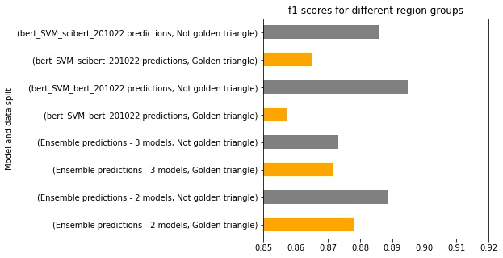
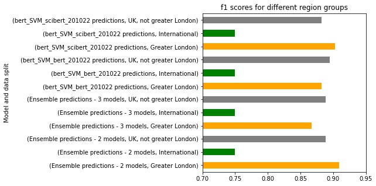
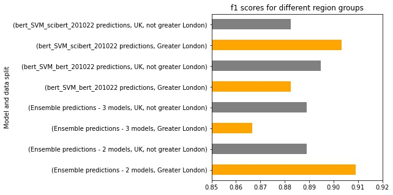
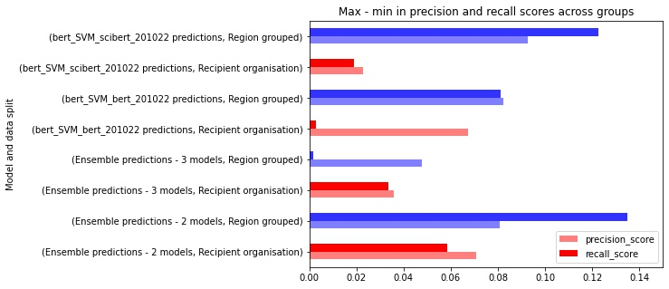

# Fairness Evaluation

In this document we will report the findings of the fairness evaluation of the find tech models.

This analysis was done on only the test data for the models, thus the data used to evaluate fairness was not used in the training of any of these models.

All this analysis was done in the `notebooks/fairness.ipynb` notebook.

This analysis has 2 goals:
1. To find out how fair the models are,
2. To pick the best model which performs well on the test data and the fairness evaluation.

## Models evaluated and test scores

We started by considering 8 models, the 4 models which performed well enough on the test data, and 4 ensemble models of these. To begin with, here is a summary of how well these models did on the test data.

| Model name 	| Sample size 	| accuracy 	| f1 	| precision_score 	| recall_score 	|
|-	|-	|-	|-	|-	|-	|
| Ensemble predictions - 1 models 	| 107 	| 0.841 	| 0.860 	| 0.788 	| 0.945 	|
| Ensemble predictions - 2 models 	| 107 	| 0.879 	| 0.885 	| 0.862 	| 0.909 	|
| Ensemble predictions - 3 models 	| 107 	| 0.869 	| 0.873 	| 0.873 	| 0.873 	|
| Ensemble predictions - 4 models 	| 107 	| 0.841 	| 0.832 	| 0.913 	| 0.764 	|
| count_SVM_201022 predictions 	| 107 	| 0.841 	| 0.847 	| 0.839 	| 0.855 	|
| bert_SVM_scibert_201022 predictions| 107 	| 0.879 	| 0.879 	| 0.904 	| 0.855 	|
| bert_SVM_bert_201022 predictions 	| 107 	| 0.869 	| 0.881 	| 0.825 	| 0.945 	|
| tfidf_log_reg_201022 predictions 	| 107 	| 0.841 	| 0.844 	| 0.852 	| 0.836 	|

Since 'Ensemble predictions - 1 models' and 'Ensemble predictions - 4 models' don't satisfy the metric cutoffs of 0.8 (F1) and 0.82 (recall and precision) we disregarded these.

Furthermore 'tfidf_log_reg_201022 predictions', 'count_SVM_201022 predictions' both perform in the worst 50% of the models for both precision and recall, so we disregard these too.

Thus, we are evaluating fairness and selecting the 'best' model from 4 options:
1. 'Ensemble predictions - 2 models'
2. 'Ensemble predictions - 3 models'
3. 'bert_SVM_scibert_201022 predictions'
4. 'bert_SVM_bert_201022 predictions'

## Fairness groups

To calculate fairness we needed to decide which groups of the data we want to compare the model performance on. From the options we had available from the grants data we chose to compare 2 things:
1. Is the recipient organisation in the Golden Triangle universities or not? (which we defined as University College London, Imperial College London, King's College London, University of Oxford, University of Cambridge).
2. Is the region Greater London, UK-based but not Greater London or international?

| Grouping | Group | Number of data points in test data |
| --- |---|---|
|Recipient organisation|Golden triangle|41|
|Recipient organisation|Not golden triangle|66|
|Region|Greater London|30|
|Region|International|10|
|Region|UK, not greater London|67|

## Fairness results

The F1 scores for the models split by recipient organisation is:



The F1 scores for the models split by the regions is:



Since the international category is so much lower than the other results, and that it contains quite a smaller sample size of 10, we chose to remove it from the analysis. Thus we can compare the region groups results in more detail without them:



### Fairness range of results

The goal of a fair model would be one in which the metrics were similar for the different groupings of the data. Thus we find the difference between the maximum and minimum metrics for the groups.
e.g. for the Recipient organisation grouping and F1 metric this would be
 ```
 max('Golden triangle F1', 'Not golden triangle F1') - min('Golden triangle F1', 'Not golden triangle F1')
 ```

| Model name 	| Grouping 	| f1 difference 	| precision_score difference	| recall_score difference	|
|-	|-	|-	|-	|-	|
| Ensemble predictions - 2 models 	| Recipient organisation 	| 0.011 	| 0.071 	| 0.058 	|
|  	| Region 	| 0.020 	| 0.081 	| 0.135 	|
| Ensemble predictions - 3 models 	| Recipient organisation 	| 0.001 	| 0.036 	| 0.034 	|
|  	| Region 	| 0.022 	| 0.048 	| 0.002 	|
| bert_SVM_bert_201022 predictions 	| Recipient organisation 	| 0.038 	| 0.067 	| 0.003 	|
|  	| Region 	| 0.012 	| 0.082 	| 0.081 	|
| bert_SVM_scibert_201022 predictions 	| Recipient organisation 	| 0.021 	| 0.023 	| 0.019 	|
|  	| Region 	| 0.021 	| 0.093 	| 0.123 	|

We can visualise the precision (lighter) and recall (darker) differences for each model and grouping (reds - recipient organisation, blues - region):



## Selecting the best model

As mentioned earlier we want to pick a model with both the best test scores and the best fairness scores.

To find the best overall fairness score, we added the metric differences for each grouping, e.g. if the F1 difference for the recipient organisation grouping was 0.011 and for the region grouping it is 0.02, then we add these to get 0.031.

The lowest scores for all three of the metrics are found in the **'Ensemble predictions - 3 models'** model.

| Model name 	| f1 sum difference	| precision_score sum difference | recall_score sum difference	|
|-	|-	|-	|-	|
| Ensemble predictions - 3 models 	| **0.024** 	| **0.083** 	| **0.035** 	|
| Ensemble predictions - 2 models 	| 0.031 	| 0.152 	| 0.194 	|
| bert_SVM_scibert_201022 predictions 	| 0.042 	| 0.116 	| 0.142 	|
| bert_SVM_bert_201022 predictions 	| 0.050 	| 0.150 	| 0.084 	|

And a recap of the test results shows this model also gives relatively high across all metrics:

| Model name   	| f1 	| precision_score 	| recall_score 	|
|-	|-	|-	|-	|
| Ensemble predictions - 2 models| 0.885 	| 0.862 	| 0.909 	|
| Ensemble predictions - 3 models| **0.873** 	| **0.873** 	| **0.873** 	|
| bert_SVM_scibert_201022 predictions| 0.879 	| 0.904 	| 0.855 	|
| bert_SVM_bert_201022 predictions| 0.881 	| 0.825 	| 0.945 	|

Thus we select this as our best model.

## Fairness results of best model

And a recap of all the fairness results for this model:

|	Grouping | Group |	Sample size	accuracy	|f1	|precision_score|	recall_score|
|---|---|---|---|---|---|
| Recipient organisation	|Golden triangle	|41	|0.872	|0.850|	0.895|
|Recipient organisation	|Not golden triangle|	66		|0.873	|0.886|	0.861|
|Region grouped	|Greater London	|30		|0.867|	0.867|	0.867|
|Region grouped	|International	|10|		0.750	|0.600	|1.000|
|Region grouped	|UK, not greater London	|67	|0.889	|0.914	|0.865|

## Conclusion:
- We pick our best model as the ensemble model which looks for agreement in 3 out of 4 models.
- This model performs equally well on the F1, precision and recall metrics for the test data - all 0.87.
- This model is less precise (0.85 vs 0.89) but has a higher recall (0.90 vs 0.86) for golden triangle universities, overall the F1 scores are the same (0.87).
- This model performs better for UK outside of Greater London in comparison to Great London regions (0.89 vs 0.87 F1, 0.91 vs 0.87 precision, similar recall).
- This model performs badly on International regions as compared to Great London or elsewhere in the UK. The precision is 0.6 and the recall is 1 for International regions.
